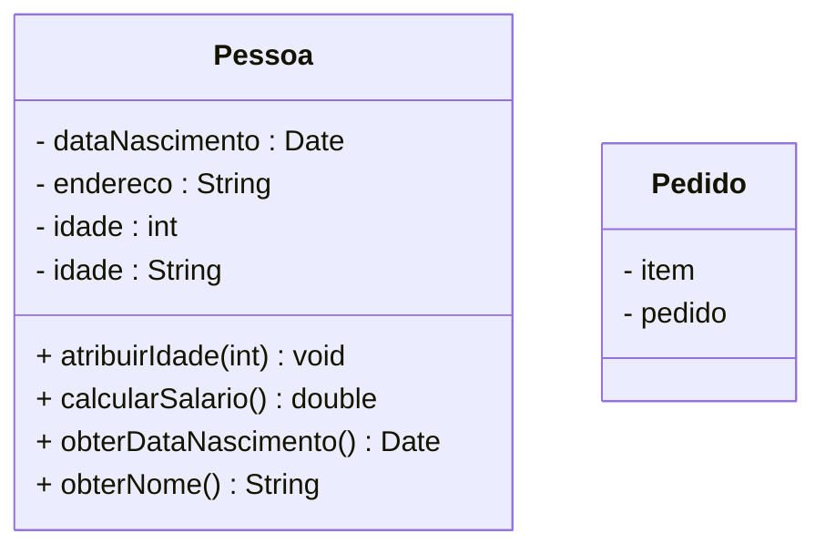

## **Introduction**
---
Software engineering is the <strong style="color: #3588e9">application of scientific principles to the design and creation</strong> of <strong style="color: #d79921">software</strong>. The field uses a systematic approach to collect and analyze business requirements in order to design, build, and test software application to satisfy those requirements.

The software engineering field became a discipline in the 1960s and evolved as new technologies were developed and the approach to the software development became more scientific.

<span style="color: #d65d0e">Software Crisis</span> <span style="color: #3588E9">--></span> mid-1960s to mid-1980s
- increasing demand for computing resources and complex software
- software development often ran over budget, behind schedule, and consisted of unmanageable, buggy code
- solution: transforming unorganized coding efforts into an established engineering discipline

Software engineers take a systematic, big picture approach in their thinking to software development whereas developers may have more creative approaches.

Software Engineering is <strong style="color: #d79921">organic</strong> <span style="color: #3588E9">--></span> the software stack under <strong style="color: #3588e9">the application is constantly changing</strong>, even when the application doesn't.

The project model does not work for software development, because it treats as a civil engineering project

>[!hint]
>Treat software development like a product development

A Engenharia de Software busca transformar um processo de produção criativa em algo que seja controlado, quantificado e previsível.

The <strong style="color: #d79921">development process</strong> is typically guided by the <span style="color: #d65d0e">Software Development Lifecycle</span> or SDLC <span style="color: #3588E9">--></span> identifies the steps needed to develop high-quality software.
##### **<span style="color:#689d6a">Software Development Lifecycle</span>**

<span style="color: #d65d0e">SDLC</span>, is a <strong style="color: #3588e9">systematic process to develop high-quality software</strong> in a predictable time-frame and budget. The goal of the SDLC is to produce software that meets a client’s business requirements.

It <strong style="color: #3588e9">defines phases of the software development process</strong> that encompass their own process and deliverables. <strong style="color: #d79921">Each phase is discrete</strong>, meaning that tasks from a previous phase do not overlap with tasks in the next phase.

<span style="color: #3588E9">--></span> Adherence to the SDLC minimizes risks and costs to the development of high-quality, deployable software.

<strong style="color: white">Advantages:</strong> improve efficiency and reduces risks; facilitates communication among stakeholders; respond to changing requirements; solve problems early in the process; reduces overlapping responsibilities.

- <strong style="color: white">Phases:</strong>
	- Planning -->
	- Design
	- Development
	- Testing
	- Deployment
	- Maintenance
##### **<span style="color:#689d6a">Application Development Lifecycle</span>**

application development lifecycle --> different phases that every application must go, regardless of the application type.

Phases: 
- Requirement Gathering --> Analysis --> Design ---> Code and Test --> User and System Testing --> Production --> Maintenance

Requirement Gathering: user ,busines and tecnical, contrains
Analysis adn Design --> analyze each requirement to create a possible  solution for the application’s design. here might be multiple rounds of verification and revision  to create a model solution that meets all the specified requirements.
maintain proper documentation with records of all updates in the design

Code and Test: he team uses the programming requirements specified in 
the design documentation to code, test, revise, and test the application programs until the code meets all documented requirements.

types of testing:
- Perform unit testing ---> { User - Performance - Integration }---> Validade test results ---> Fina tested programs

Production: end users can access and use it. ensure that the application functions accurately and is available to users. it must remain in a steady state

Maintenance: The application might need an upgrade, or you might need to add new features. In this case, the new features must go through all previous phases before being integrated into the application version deployed in production

maintaining multiple files for coding different functionalities --> best practive
- requirements for functionalities vary
- best practice: code each functionality in a separate file
	- makes code maintenance efficient adn easy
	- helps when new functionality is added
##### **<span style="color:#689d6a">Software Versions</span>**

<span style="color: #d65d0e">Software versioning</span> is <strong style="color: #3588e9">how software developers keep track of new software</strong>, updates, and patches for programs and applications.

Software version numbers vary in length and meaning. However, most version numbers follow a similar format and represent similar information.

<span style="color: #d65d0e">Version numbers</span> <strong style="color: #d79921">indicate</strong> when the software was released, when it was updated, and if any minor changes or patches were made to the software.

Version numbers can be short or long, depending on the software and the preference of the developer, with 2, 3, or 4 number sets. Each number set is divided by a period.

- <strong style="color: #d79921">Versionamento Semântico</strong>
	- utilizado tanto em módulos quanto em APIs, estabelece que há uma versão maior, uma versão menor e um patch. 
		- <span style="color:#3588e9">versão</span><span style="color: #98a2ad">:</span> <span style="color:#c6554f">"4 . 16 . 3"</span>
	- Versão Maior (Breaking) - first number set
		- Possivel quebra de compatibilidade
	- Versão Menor (Feature) - second number set
		- Compatibilidade retroativa
		- Funcionalidade depreciada, mas funcional
		- Refatoração interna
	- Patch (Fix) - third number set
		- Correção de Bugs
	- Example: Ubuntu Linux version 18.04.2 --> The third number set, point-2, designates an additional change or update. 
	- Some software developers may use dates for their versioning. In that case, released in 2018 April
---
- <span style="color: #d65d0e">Release</span> <span style="color: #3588E9">--></span> newest distributed version of a software. There are different types of releases which are intended for specific audiences.
	- The first release of a program, might have a 1.0 as the version number to indicate no updates, patches, or fixes to the software.
	- <span style="color: #98971a">alpha release</span> <span style="color: #3588E9">--></span> first functioning version of the system to a select group of stakeholders.
	 - <span style="color: #98971a">beta release</span> <span style="color: #3588E9">--></span> distributed to the stakeholders outside of the developing organization.
		 - it's called limited release
		 - it's intent is to try out the software under real conditions, test the functionality, and identify any outstanding bugs or error.
	- <span style="color: #98971a">GA release</span> <span style="color: #3588E9">--></span> stands for general availability.
		- it's the stable version distributed after beta release changes are agreed upon, made, and tested. It's the version for all users
		- 
## **Gerenciamento Ágil de Projetos**
---
## **Software Development**
---
<span style="color: #d65d0e">Software development</span> is a <strong style="color: #d79921">craft work</strong> <span style="color: #3588E9">--></span> it's creating a one-of-a-kind application that doesn't exist yet.

>[!note]
>O desenvolvimento de software é evolutivo por natureza.

A <span style="color: #d65d0e">Reengenharia de software</span> é o trabalho de reforma de um software <span style="color: #3588E9">--></span> será melhorada para atender por exemplo, uma evolução da própria necessidade do usuário. Ela é <strong style="color: #d79921">realizada para melhorar o desempenho</strong>, pode ser usada para melhorar a manutenibilidade, a arquitetura que ficou obsoleta, para promover a transformação digital (inovação) das organizações.
- Deve ser realizada com proposito de diminuir a complexidade de um software, e reduzir custos e riscos.
- Também pode ser realizada para aumentar o valor entregue aos usuários.

<span style="color: #d65d0e">Refatoração</span> <span style="color: #3588E9">--></span> alteração da estrutura do código sem afetar o comportamento da aplicação

Concepção do projeto <span style="color: #3588E9">--></span> Etapa que acontece praticamente em todo projeto de sistemas de informação (necessidade de resolver um problema do usuário).

IBM Rational Unified Process --> metodologia da IBM, traz orientações de como percorrer todo o processo de desenvolvimento de um software.
- gráfico das baleias --> visão de fases do processo de desenvolvimento.
##### **<span style="color:#d79921">Fase de projeto</span>**

Modelagem Arquitetural --> diagrama que exibe os elementos/componentes de software do produto e como eles se relacionam (como são as conexões, do acoplamento existente, que tipo de comunicação sera utilizada, acesso ao bando de dados).
- Determina a intenção de estruturação dos elementos do software. Como será a comunicação, padrões de implementação, restrições e em alguns casos, expressa as tecnologias que serão adotadas.

Modelagem de Dados -->
5 atividade metologicas básicas de um processo de software: comunicar, planejar, modelar, construir e entregar.

- entity framework --> ORM
	- ORM - Object Relational Mapping --> facilitam as operações de CRUD, são intermediários entre o banco de dados e a aplicação.
		- --> Por padrão não se devolve os objetos vinculados com a entidade para não sobrecarregar.
		- dapper --> micro ORM
		- A camada de infra irá comportar a classe de acesso a dados
		- entidade de Dominio --> classe (representação de um objeto do mundo real) referente algo do sistema
		- os projetos se comunicam, fazem referencia um com o outro --> no arquivo <code>.csproj</code>

```c#
// Referencia do projeto 2 no projeto 1
<ItemGroup>
	<ProjectReference Include="../2-) myfinance-web-dotnet service/myfiance-dotnet-service.csproj">
</ItemGroup>

// Todo mundo pode acessar a camada de dominio, mas o dominio não acessa ninguem. O projeto de dominio não aponta para ninguem
```

tools: nugget (plataforma de pacotes), entityframework core, connectionstrings

#### **<span style="color:#689d6a">Code Practices</span>**

Part of the software development process for the development of secure software. Implementing code practices is an important part of developing secure software and when implemented early in development, is cost-effective because correcting insecure code later in the software development process is expensive.
Security is a major concern in the DevOps community because attackers target insecure code in the application layer

General Practices

Implement a secure software development lifecycle
Establish secure coding standards --> establishes good habits
Build and use reusable object libraries for efficiency and to reduce risk
Develop with only tested and approved managed code
Implement safe updating by focusing on exposed threats or source code that contains security-critical components

Input Validation
means to check (on the server side), that the input provided by user or attacker is what you expect it to be --> validate any data that's used that a hacker can manipulate. Example: expected data types; data range, and data length; allowed characters against a "white" list.

Reject any non-conforming data
Validate data from untrusted sources
Reduce any additional risk by developing on trusted and hardened systems only

 Input Scrubbing
 
Whitelist validation should always be performed for allowed characters
Scrub or remove any malicious characters if entered as input data. Ex: <>>"'%()&+\\'\" --> anything that the attacker can use to make your application do something it wasn’t intended to do.
 Implement additional controls. Ex: output enconding, securing task-specific APIs, accouting for all data.
 
Output Incoding

 is the translation of input code to safe output code
Implement a policy and practice for each type of outbound encoding used
Encode all characters
sanitize all output of untrusted queries such as SQL, XML, and LDAP
Sanitize untrusted ouput to local operating system commands

Error handling and logging

Iproper handling expose risks
Meaningul error m=essages and logging --> attacker can exloit it. The goal should be to provide meaningful error messages to the user, provide diagnostic information for troubleshooting, and provide no useful information to an attacker
Use custom error pages and generic messages
Release allocated memory when any error conditions occur to avoid corruption
implement access restrictions to logs
log any types of tampering events and failures such as input, authentication attempts, and access control

#### **<span style="color:#689d6a">Dependencies</span>**

Dependencies are reusable code found in a library package or module that your code makes calls to. You can use a package manager to automate the download and installation of dependencies.

A dependency is needed when a piece of software or code relies on another to function. They’re commonly used to add features and functionality to software without writing it from scratch.

- Benefits:
	- speeds up development process
	- deliver software quickly --> building on previous work 
	- more fetaturs, functionality --> could perform better than the native implementation

- Risks
	- Using code from Internet is risky
	- Exposute to vulnerabilities
	- Production risks --> performance issues, craahsers, data leask
	- License cahllenges --> complicane and compatinbility

#### **<span style="color:#689d6a">Secure Development Environment</span>**

Apps developed without security input from Ops are highly susceptible to cyber-attacks.

Involve Security team early on.

development environment must be secure, too. Development systems and platforms are also vulnerable to the same types of attacks as production machines.

Everyone should understand the importance of secure app development and securing theenvironment they’re developed on and deploying to. If the environment isn’t secure , it's difficult to accept that the code coming from it is also secure

Security is a team effort. Anything touching the app, its services, its platform has a responsability for security.

A secure development environment is an ongoing process of securing the network, compute resources, and storage devices both on-premise and in the cloud.

It's important to physically securing development machines and use separate machines for coding and business.

use complex passwords and frequent password changes, and implement multifactor authentication

Protect the code repository and secure your build and development pipeline.

Insecure dev environemnt is an environment where: Production systems are secure, but the development environment where coding is built and deployed is a free-for-all with direct connections to the production infrastructure

Unrestricted access to unapproved code repositories and lack of governance or policies for obtaining code could allow suspect software dependencies into your application.

- best practices
	- Secure internet connection - regular ports scans, strict firewall
	- multifactor authentication
	- Additional security
	- monitoring developer environemntds adn activies
		- lock it down,
		- prevent workarounds,
		- montor activity
		- track commits --> pre-commit hooks, to check to make sure that developers aren’t checking in sensitive data like credentials to their code repositories.
## **Engenharia de Requisitos**
---
<span style="color: #d65d0e">Requisito de software</span> é uma <strong style="color: #3588e9">condição ou uma capacidade necessitada por um usuário para resolver um problema</strong> ou atingir um objetivo. Exemplos: precisar automatizar um processo, ou precisar que esse processo seja executado de maneira mais rápida.
- Característica do sistema ou a descrição de algo que o sistema é capaz de fazer

> Um requisito precisa ser não ambíguo, testável e mensurável.

Requisitos iniciais não devem descrever mais do que o necessário para definir o problema.

- <strong style="color:#d79921">Tipos de requisitos</strong>
	- <strong style="color: #98971a">Requisitos funcionais</strong> <strong style="color: #3588E9">--></strong> relacionados a ações que o sistema deve executar.
		- Descrevem as funcionalidades que um sistema de software deve ter.
		- São descritos através dos casos de uso ou estorias de usuário.
		- O sistema deve/irá prover/permitir a (usuário) habilidade de (verbo)
		- Exemplos: 
			- O sistema deve permitir ao Administrador gerenciar o cadastro de usuário. 
			- Alunos devem ser capazes de acessar e visualizar suas notas
	- <strong style="color: #98971a">Requisitos não funcionais</strong> <span style="color: #3588E9">--></span> relacionados a restrições das funcionalidades ou no sistema como um todo.
		- Condições que o sistema deve atender.
		- São descritos detalhando as características de qualidade da aplicação.
		- Possuem escopo da aplicação.
		- Tipos: Usabilidade, Confiabilidade, Desempenho.
		- O sistema deve ser capaz de {ação} em menos de {desempenho}
		  O sistema deve ser capaz de {ação} enquanto {condições operacionais}
		- Ex: A base de dados do sistema deverá ser armazenada em MySQL.
	- <strong style="color: #98971a">Requisito de cliente</strong> <span style="color: #3588E9">--></span> o detalhamento dos requisitos evolui durante um projeto
		- Origem no cliente e nos usuários.
		- Descrevem as características desejáveis de uma solução.
		- Também chamados de requisitos de usuário.
	- <strong style="color: #98971a">Requisito de sistema</strong> <span style="color: #3588E9">--></span> descreve o comportamento de um sistema de computação
		- Uma escolha dentro do domínio delimitado
		- Também são chamados de requisitos do produto.

<span style="color: #d65d0e">Critério de aceitação</span> <span style="color: #3588E9">--></span> tudo aquilo (características) que será utilizado para garantir que o produto a ser recebido poderá ser aceito/usado. Exemplo: funcionalidades básicas de uma TV.

<span style="color: #d65d0e">Domínio</span> <span style="color: #3588E9">--></span> tudo aquilo ligado ao ambiente (Ex: domínio jurídico); aquilo que uma solução de software executa.

<span style="color: #d65d0e">Engenharia de requisitos</span> <span style="color: #3588E9">--></span> conjunto de processos e atividades planejadas e realizadas sistematicamente com o intuito de definir, detalhar e gerenciar o conjunto de requisitos de um software.

> [!note]
> A Engenharia de requisitos está dividida em dois grandes macro-processos: Desenvolvimento de requisitos e a Gerência de Requisitos <span style="color: #3588E9">--></span> a aprovação é que separa cada processo (comprometimento com os requisitos).
#### <strong style="color:#689d6a">Desenvolvimento de requisitos</strong>

<span style="color: #d65d0e">Desenvolvimento de Requisitios</span> <span style="color: #3588E9">--></span> conjunto de atividades que permite determinar os <span style="color: #d65d0e">requisitos funcionais</span> e <span style="color: #d65d0e">não-funcionais</span> de um produtos e seus componentes. 

Possui 4 etapas:  Elicitação de requisitos, Priorização e Negociação, Detalhamento, Documentação e Modelagem de requisitos, e, por fim, a Verificação e Validação de requisitos.
##### <span style="color: #98971a">Elicitação</span>

- Consiste na busca pró-ativa de requisitos a partir das fontes
	1. Também chamado de levantamento, coleta, identificação ou captura de requisito.
	2. Deve-se definir as fontes para coleta dos requisitos
	3. Deve-se definir a técnica para a elicitação dos requisitos
	4. Nessa fase, o resultado (saída) é uma Lista de Requisitos --> documento de visão (Métodos Tradicionais), ou lista de pendencias --> backlogs (Métodos Ágeis).

<strong style="color:#c6554f">Obs:</strong> evitar requisitos implícitos e ambíguos.

<strong style="color: white">Fontes comuns:</strong> usuário e cliente, documentos, sistemas existentes, estudos, questionários.

Um <strong style="color: #d79921">bom requisito</strong> deve ser correto, conciso, consistente, testável, realista e atômico.

Descrição geral do problema sendo resolvido
- visão geral do produto

<span style="color: #d65d0e">JAD</span> <span style="color: #3588E9">--></span> Joint Application Development
- reunião estruturada com representantes dos usuários.
- <strong style="color: white">objetivo:</strong> resolução antecipada de conflitos.
######  <span style="color:#d79921">Técnicas de Elicitação</span>

Lorem ipsum
##### <span style="color: #98971a">Negociação e priorização</span>

Consiste no exame dos requisitos coletados e negociação com os stakeholders.

Em métodos ágeis, a priorização é uma atividade que ocorre constantemente.

Requisitos tem custos associados diferentes.

MoSCoW --> "Must have", "Should have", "Could have", "Won't have".
- acrônimo utilizado para priorização de requisitos.

Modelo de Kano --> requisitos obrigatórios e não esperados (inovação)
- traz a ideia de expectativa para o usuário
##### <span style="color: #98971a">Detalhamento, documentação e modelagem</span>

abordagem: Análise Orientada a Objetos <span style="color: #3588E9">--></span> modela conceitos que existem no mundo real, seus relacionamentos e comportamentos.

atores <span style="color: #3588E9">--></span> entidades que interagem com os sistemas
- são elementos externos ao sistema
- categorias: Pessoas, Organizações, Outros Sistemas, Equipamentos.

contexto do sistema:  parte do ambiente que é relevante

diagrama de contexto:  representação resumida dos limites do sistema
- <strong style="color:#c6554f">obs:</strong> não é um diagrama de caso de uso

associações: relacionamento entre atores e casos de uso
######  <span style="color:#d79921">Modelo de Casos de Uso</span>

Modelo de casos de uso fornecem uma perspectiva do sistema de um ponto de vista externo.

<span style="color: #d65d0e">Casos de Uso</span> <span style="color: #3588E9">--></span> representa uma sequência de interações/ações entre o sistema e o ator. É uma técnica para descrever funcionalidades de um sistema.
- Fornece um modelo conceitual do sistema
- Escopo <span style="color: #3588E9">--></span> sempre iniciado por um ator
- Fluxo de eventos <span style="color: #3588E9">--></span> conjunto de atividades que descrevem o que acontece a partir do momento em que o caso de uso é iniciado
	- sempre frases na voz avita
	- sem nenhum detalhamento técnico
	- o sujeito é sempre o sistema ou o ator que se relaciona com ele
- <strong style="color: white">Características:</strong>
	- originam-se das funcionalidades do sistema 
	- é uma tarefa completa da perspectiva do ator
	- evidencia o relacionamento entre o ator e o sistema
- <strong style="color: white">Exemplo:</strong>
	- Efetuar Compra
	- Pesquisar Produtos
	- Emitir relatório do mais vendido

<span style="color: #d65d0e">Requisitos especiais</span> <span style="color: #3588E9">--></span> forma de representação de requisitos que complementa a modelagem de Casos de Uso.
- Requisitos não funcionais
- Regras de Negócio 
	- são procedimentos detalhados, que dirigem o comportamento de negócios em determinada situação.
	- são regras que o sistema deve implementar.
	- podem ser utilizadas em diversos fluxos, dentro do mesmo caso de uso.
- Interface Gráfica
	- determina comunicação com usuários
	- pode ser realizada com ferramentas de prototipação
	- os campos de entrada e saída podem ser especificados
> Obs: Não são regras da UML
##### <span style="color: #98971a">Verificação e Validação</span>

Se insere no contexto de qualidade dos requisitos

Podem ocorrer de forma separada
#### <strong style="color:#689d6a">Gerência de Requisitos</strong>

Gerencia de requisitos --> trata de questões relacionadas a mudanças, inconsistências, analise de impacto, rastreabilidade.
as atividades irão variar se estiverem em métodos tradicionais (controle rígido das mudanças) e em métodos ágeis.
mudança --> a partir do momento em que um combinado foi feito.
projetos de escopo fechado, se o escopo for alterado o custo e prazo devem ser alterados.
a formalidade vai depender da fase em que se está, do tipo de contrato, do tipo de relação com o cliente. Pode ser mais formal ou menso formal.
a gerência de requisitos gerencia os requisitos recebidos ou gerados pelo projeto.
rastreabilidade --> grau do relacionamento que será estabelecido entre um ou mais produtos do desenvolvimento de software que terão algum tipo de relação.

Diagrama de atividades --> consiste em representação de um fluxo de controle de um processo (modelagem sequencial).
representação simples, elementos simples e fáceis de entender por todos os envolvimento.  
Obs: com o advento da BPMN, o diagrama de atividades tem caído em desuso, tem sido substituído por um notação um pouco mais poderosa.

Diagrama de estados

Diagrama de classes --> diagrama da UML utilizado para representar o aspecto estático.
classe --> modelo para um objeto, defini um novo tipo de dados.
atributos --> utilizados para armazenar informações de uma classe.
objeto --> instancia de uma classe
operações (métodos) --> utilizadas para trocar mensagens entre os objetos
invocadas a partir de um objeto


Multiplicidade
Participação
Associação
Classe associativa
Agregação
## **Agile Development**
---
<span style="color: #d65d0e">Modelagem Ágil</span> é uma atitude, não um processo prescritivo de software. Compreende um conjunto de <strong style="color: #d79921">valores e princípios</strong>.

> Resulta em software de melhor qualidade e de desenvolvimento mais rápido.

Agile is an iterative approach to project management that helps teams to be responsive and deliver value to their customers faster.

Agile <strong style="color: white">emphasizes</strong>:
- Adaptive planning
- Evolutionary development
- Early delivery
- Continual improvement
- Responsiveness to change

<span style="color: #d65d0e">Agile Manifesto</span> 

<span style="color: #d65d0e">Agile software development</span> --> an iterative approach to software development that conforms to the Agile Manifesto.
- Emphasizes flexibility, interactivity, and a high level of transparency.
- Uses mall, co-located, cross-functional, self-organizing teams

Agile is a philosophy for doing work (not prescriptive)

<span style="color: #d65d0e">Agilidade</span> <span style="color: #3588E9">--></span> <strong style="color: #3588e9">eficácia para responder a mudanças</strong> e eficácia na comunicação entre os stakeholders (envolvidos).

<span style="color: #3588E9">--></span> <strong style="color: #d79921">Ser Agil</strong> significa fazer bem feito para fazer um vez só.

<span style="color: #d65d0e">Processo Ágil</span> <span style="color: #3588E9">--></span> dirigido por cenários construídos pelo cliente com seus requisitos

> [!note]
> Agile <strong style="color: #b16286">is not</strong> just the developers working in each sprint, it <span style="color: #d79921">involves a cross-functional teams</span>

As metologias ágeis admitem que serão realizados pequenos incrementos do software <span style="color: #3588E9">--></span> a cada <strong style="color: #d79921">iteração</strong>

- <span style="color: #d65d0e">Working Agile</span>
	- Working in small batches <span style="color: #3588E9">--></span> from lean manufacturing
	- Use Minimum Viable Product (MVP)
	- BDD
	- TDD
	- Pair Programming <span style="color: #3588E9">--></span> came from XP

<span style="color: #d65d0e">MVP</span> (Minimum Viable Product) <span style="color: #3588E9">--></span> the cheapest/easiest thing that can be done to test the value of a hypothesis and learn.
- It's not the result of "Phase 1" of a project
- It used to figure out what does the customer like, and doesn't like
- At the end of each MVP it's decided whether to pivot or persevere

<span style="color: #d65d0e">Technical debt</span> <span style="color: #3588E9">--></span> anything that need to be done that doesn't involve creating a new feature
- <strong style="color: white">Examples:</strong>
	- Code refactoring
	- Setup and maintenance of environments
	- Changing technology like databases

<span style="color: #d65d0e">Pair programming</span> <span style="color: #3588E9">--></span> two programmers work together at one workstation
- one writes the code, the other reviews each line of code as it is typed
- the two programmers switch roles frequently (e.g., 20 min)
- code quality increases as defects are found earlier

In Agile, teams are loosely coupled tightly aligned, and each team has its own mission aligned with the business. Team have <strong style="color: #d79921">end-to-end responsibility</strong> for what they build.

To get the full benefit of being Agile, DevOps should be adopt as a practice as well, so that the ops team is just as agile as the development team.

A refatoração é pivô dos métodos ágeis para o design <span style="color: #3588E9">--></span> o <strong style="color: #d79921">design emergente</strong> é fruto de uma boa refatoração.
- melhorar o código: reduzir o acoplamento, aumentar a coesão, melhorar a legibilidade, melhorar a manutenibilidade. 

<strong style="color: #d79921">Agile Planning tools: </strong>
- <span style="color:#98971a">ZenHub</span> <span style="color: #3588E9">--></span> plug-in to GitHub
	- it provides a kanbam board and project management reporting
	- helps to manage in a project based on GitHub Issues
	- maintains up-to-date status due to integration with GitHub
	- <strong style="color: white">default pipelines:</strong> new issues - icebox - product backlog - sprint backlog - in progress - review/QA - done
		- icebox: things that are going to be on a long-work term
		- done: means the developer is done, It doesn't mean that it's been accepted by the product owner
- <span style="color:#98971a">Kanbam Board</span> <span style="color: #3588E9">--></span> visual way
	- things that you need to do, things that you're doing, and things that you've  already gotten done (To Do, Doing, Done)
###### <span style="color: #d79921">User Story</span>

It represents a piece of business value that the team can deliver in an iteration. 

Stories should contain:
- a brief description of the need and business value
- any assumptions or details
- some acceptance criteria

User stories document a persona requesting a function to achieve a goal.

> [!example]
> As a `<some role>`
> I need `<some function>`
> So that `<some benefit>`

> [!example] Sample story
>As a Marketing Manager
>I need a list of customer names and emails
>So that I can notify them of marketing promotions
> 
>Assumptions and Details:
>- We maintain customer email
>- Customers have opted-in to promotions
>   
>Acceptance Criteria:
>- Given the are 100 customers in the database
>- And 90 have opted into email promotions

A story should be small enough to be code and tested within a single sprint iteration - ideally, just a few days

<span style="color: #d65d0e">INVEST</span> <span style="color: #3588E9">--></span> acronym for a good user story
-  Independent, Negotiable, Valuable, Estimable, Small, Testable

<span style="color: #d65d0e">Epic</span> <span style="color: #3588E9">--></span> a user story that too big to estimate on its own
- when a story is too large in scope

Backlog items tend to start as epics when they are lower priority and less defined
for sprint planning, epics should be broken down into smaller stories.

<span style="color: #d65d0e">Story points</span> <span style="color: #3588E9">--></span> metric used to estimate the difficulty of implementing given user story 
- an abstract measure of overall effort
- it measures: effort, complexity and uncertainty
- story points use relative T-Shirt sizes (S, M, L, XL)
- most tools use Fibonacci numbers (1, 2, 3, 5, 8, 13, 21) --> to track velocity

Since story points are relative, it's important to agree on what "medium" is, the evaluate from there
##### **<span style="color:#689d6a">XP - Extreme Programming</span>**

Introduced by Ken Beck in 1996, Extreme Programming it's based on an iterative approach to software development. And in fact, this is where Agile got it from. 

The intent is to improve software quality, to be responsive to change, to be responsive to customer requirements, and do thing in small increments. O XP enfatiza a colaboração e a criação de software cedo e rápido. 

<strong style="color: white">Papeis do XP:</strong> Coach, Cliente (Product Owner no Scrum), Programadores, Testadores (Developer Team no Scrum).

<strong style="color: white">XP values:</strong>
- <span style="color: #d79921">Simplicity</span> <span style="color: #3588E9">--></span> just do what need to be done
	- don't over-engineer
	- don't over code
	- don't deliver more code than the customer asked for
- <span style="color: #d79921">Communication</span> <span style="color: #3588E9">--></span> everyone on the team should be communicating about what everyone else is doing
	- envolve pair programming and stand-up meeting
	- o envolvimento com os usuário é através da escrita de testes de aceitação
- <span style="color: #d79921">Feedback</span> <span style="color: #3588E9">--></span> através de estimativas de tempo
	- ciclo de desenvolvimento rápido - pequenos incrementos/entregas
	- adoção do TDD
	- há sempre integração contínua
- <span style="color: #d79921">Respect</span> <span style="color: #3588E9">--></span> everyone feels that they are respected on the team
	- there's no hierarchy, 
	- everybody has peers on the team, and respected for their idea
- <span style="color: #d79921">Courage</span> <span style="color: #3588E9">--></span> everyone is very honest about what they can do
	- the estimates are not exaggerated
##### **<span style="color:#689d6a">Scrum</span>**

It's a <strong style="color: #b16286">management framework</strong> for incremental product development. Scrum emphasizes small, cross-functional, self managing teams, and it provides a structure of roles and rules, and artifacts.

Scrum is a methodology for doing work (add process) <span style="color: #3588E9">--></span> <strong style="color: #b16286">it's prescriptive</strong>. It has a goal build a potential shippable product increment with every iteration, so it uses fixed-length iterations called <span style="color: #d65d0e">sprints</span> (time-boxed sprints).

O Scrum é baseado na premissa que se pode dividir a funcionalidade dentro do tempo. 

Agnóstico em termos de arquitetura ou design detalhado <span style="color: #3588E9">--></span> não considera a arquitetura ou alguma complexidade de design na hora de preparar as sprints.

<strong style="color: white">Scrum process</strong>
- Product Backlog -- `[ Sprint Planning ]` -->  Sprint Backlog --> 2 Weeks Sprint --> Valuable Product

<strong style="color: white">Scrum Roles (Papeis)</strong>
- <span style="color:#98971a">Product Owner (PO)</span> <span style="color: #3588E9">--></span> responsável pelo Product Backlog
	- represents the stakeholder interests
	- articulates the product Vision
	- accepts or reject each project increment
	- define os itens e as prioridades do Product Backlog --> adjust any expectations
	- define os objetivos para a próxima Sprint
	- revê o produto ao final de cada Sprint
- <span style="color:#98971a">Scrum Master (SM)</span> <span style="color: #3588E9">--></span> gerencia o processo do Scrum
	- facilitates the Scrum process
	- help the rest of the team implement Scrum
	- creates an environment to allow the team to be self-organizing
	- shields the team from external interference
	- helps resolve impediments
	- enforces sprint time-boxes
	- captures empirical data to adjust forecasts
	- has no management authority over the team
- <span style="color:#98971a">Scrum Team (ST)</span> <span style="color: #3588E9">--></span> cross-functional team
	- consist of developers, testers, business analyst, domain experts, others
	- self-organizing --> não há uma divisão funcional
	- they self-assign their own work
	- consists of 7 + 2 collaborative members
	- dedicated --> full-time membership
	- negotiates commitments with the product owner

<strong style="color: white">Scrum Events</strong>
- <span style="color:#98971a">Scrum Planning Meeting</span> <span style="color: #3588E9">--></span> reunião de planejamento com o PO e SM
	- a equipe seleciona as atividades para a Sprint
	- as tarefas são transferidas do Product Backlog para o Sprint Backlog
- <span style="color:#98971a">Daily Scrum meetings</span> (a.k.a. daily stand-up)
	- happens every day --> usually in the same place, same time
	- reunião de duração de 15 minutos
	- o que foi feito? quais são os impedimentos? o que sera feito?
	- involves: Scrum master, Development team, PO (optional)  
	- atualização do Gráfico de Burn-down
	- impediments identified by the team should be unblocked by the scrum master
	- é apenas uma reunião de acompanhamento
- <span style="color:#98971a">Sprint</span> <span style="color: #3588E9">--></span> is the two weeks in which everybody is working
	- is one iteration through the design, code, test and deploy cycle
	- it is usually 2 weeks in duration
- <span style="color:#98971a">Sprint Review</span> <span style="color: #3588E9">--></span> live demonstration of implemented stories
	- Product owner determines if storied are done based on acceptance criteria
	- Done stories are closed
	- involves: PO, SM, Development team, Stakeholders, Customers (optional)
	- 1 hora para cada semana de Sprint
	- valida os objetivos da iteração e a finalização das histórias
	- feedback gets converted into new product backlog stories
- <span style="color:#98971a">Sprint Retrospective</span> <span style="color: #3588E9">--></span> meeting to reflect on the sprint
	- measures the health of the process
	- the development team must feel comfortable to speak freely
	- involves: Scrum master and Development team
	- What went well? (keep doing) - What did not go well? (stop doing) - What should we change for the next sprint? 
	- the scrum master must ensure that changes are made as a result of the feedback
	- the goal is to improve for the next sprint

<strong style="color: white">Scrum Artifacts</strong>
- <span style="color:#98971a">Product Backlog</span> <span style="color: #3588E9">--></span> lista de requisitos priorizada
	- PO sorts in order of importance
	- The team may provide estimates and other technical information
	- Large vague items are split and clarified
- <span style="color:#98971a">Sprint Backlog</span> <span style="color: #3588E9">--></span> principal divisão de trabalho
	- stories to be accomplish in the next sprint
	- is one iteration through the design, code, test and deploy cycle
	- print backlog is smaller than the product backlog
	- every sprint should have a goal
	- sprints are usually 2 weeks in duration
- <span style="color:#98971a">Done increment</span> <span style="color: #3588E9">--></span>  product increment that is completed by the end of a sprint
- Relatórios
	- são relatórios importantes para o controle de desempenho das esquipes
	- relatório de burn down --> acompanhamento do tempo restante para concluir as tarefas

<span style="color: #d65d0e">Product Backlog</span> <span style="color: #3588E9">--></span> contains all the unimplemented stories not yet in a sprint. Stories are ranked in order of importance and/or business value, which are more detailed at the top, less detailed at the bottom.

<span style="color: #d65d0e">Backlog Refinement</span> <span style="color: #3588E9">--></span> keep the product backlog ranked by priority so that the important stories are always on top
- Break large stories down into smaller ones
- Make sure that stories near the top of the backlog are groomed and complete
- Make sure the story contains enough information for a developer to start working on it

The Backlog refinement meeting involves: Product Owner, Scrum Master, Development Team (optional). 

<span style="color: #d65d0e">Sprint planning</span> <span style="color: #3588E9">--></span> the purpose is to define what can be delivered in the sprint and how that work will be achieved
- accomplished by producing a sprint backlog
- involves the Product Owner, Scrum Master and Development Team
- the PO describes the goal and product backlog items supporting it
- assigns story points and labels
- ensures each story contains enough information for a developer to start working on it

- <strong style="color: white">New issue triage</strong>
	- Move the stories into the product backlog if they will be worked on soon
	- Move them into the icebox if they are a good idea but not now
	- Reject them if they are not where we want to go

Scaling Agile @Spotify: tribes - squads - guild - chapter

<strong style="color: white">Benefits:</strong> higher productivity, better product quality, reduce time to market, increased stakeholder satisfaction, better team dynamics, happier employees
##### **<span style="color:#689d6a">Kanbam</span>**

Developed by Toyota in 1953, which it's in fact the Japanese manufacturing systems.

Kanbam <strong style="color: #b16286">literally means billboard sign</strong>, and it's all continuous flow on the 
manufacturing floor, where these cards or notes would flow with the product from station to station, going down the line.

The card are used to indicate flow of a series production, and each task is associated with a card <span style="color: #3588E9">--></span> the numbers of tasks or cards it's equivalent to system capacity.

The <strong style="color: #d79921">core principle</strong> with Kanban are <strong style="color: #b16286">visualize the workflow</strong>, if the work can't be seen, so it can't be managed.

<strong style="color: white">Core principles</strong>
- Visualize the workflow (processo)
	- If you can't see the work, you can't manage the work
- Limit the work in progress (WIP)
- Manage and enhance the flow (gerenciamento do lead-time) <span style="color: #3588E9">--></span> tempo que a atividade leva para passar por todas as fases ate a sua entrega
- Make process policies explicit
- Continuously improve <span style="color: #3588E9">--></span> changes can happen at any time

>[!note]
>In Kanbam there no existing roles
## **Software Architecture**
---
<span style="color: #d65d0e">Software architecture</span> <span style="color: #3588E9">--></span> organization of the system.

The architecture comprises the fundamental structures of a software system and explains the behavior of that system. It defines how components should interact with each other, the operation environment, and the principles used to design the software.

The software architecture <strong style="color: #3588e9">captures early design decisions</strong> that are often costly to change once implemented.

Ao projetar a arquitetura:
- Quais são grandes partes do software e como elas se comunicam?
- Onde essas partes são executadas?

<span style="color: #d65d0e">Topologia</span> <span style="color: #3588E9">--></span> distribuição física dos componentes de software nos componentes de hardware (mapeamento do software para o hardware).

A software's architectures addresses <span style="color: #d65d0e">non-functional aspects</span> of the applications such as performance, scalability, maintainability, interoperability, security and manageability.

Architectural design also <strong style="color: #3588e9">guides</strong> the choice of <span style="color: #d65d0e">technology stacks</span> (non-functional requirements) used for the system, which paramount in the design phase.

<span style="color: #d65d0e">Requisitos arquiteturais</span>
- requisitos que tem um alto valor para o negócio
- requisitos que possuem alguma complexidade tecnológica

> [!note] 
> Os requisitos arquiteturais são requisitos contextuais, pois dependem da aplicação do cliente. São selecionados baseado no contexto específico de cada projeto, nas suas condições de execução.

<span style="color: #d65d0e">Atributos de qualidade</span> <span style="color: #3588E9">--></span> também conhecidos como requisitos não-funcionais, e definem como o sistema executará suas funcionalidades.
- <strong style="color: #b16286">Tipos:</strong>
	- <span style="color: #98971a">Produto:</span> ditam como o sistema irá se comportar (Ex: escalabilidade)
	- <span style="color: #98971a">Organizacionais:</span> padrões ou regras impostas pela organização
	- <span style="color: #98971a">Externos:</span> leis impostas sobre software, requisitos de interoperabilidade entre sistemas.

There are also several artifacts produced during the architectural design phase that are used to communicate the software design to the stakeholders. These artifacts include a <span style="color: #d65d0e">Software Design Document</span> (SSD), an architectural diagram, and <span style="color: #d65d0e">Unified Modeling Language</span> (UML Diagrams) --> permite expressar a arquitetura de software. (Diagrama de componentes e implantação).

<span style="color: #d65d0e">Software Design Document</span> <span style="color: #3588E9">--></span> <strong style="color: #3588e9">collection of technical specifications</strong> that indicate how the design should be implemented. It provides a functional description of the software and design considerations such as assumptions, dependencies, constraints, requirements, objectives, and methodologies.

The <span style="color: #98971a">architectural diagram</span> displays components, their interactions, their constraints, and their confines. It displays the architectural patterns used in the design <span style="color: #3588E9">--></span> general, reusable solutions to commonly occurring problems. 

<span style="color: #d65d0e">Unified Modeling Language</span> <span style="color: #3588E9">--></span> diagrams that communicate structure and behavior using common programming language agnostic notation.

The architecture drives choices about the <span style="color: #d65d0e">environment</span> in which the software is released. The production environment is comprised of the infrastructure that runs and delivers the application to the end-user such as the servers, load balancer, and databases.

Os <strong style="color:#3588e9">processos prescritivos</strong> ou processos dirigidos por planos, são <strong style="color: #b16286">processos que concentram-se inicialmente em planejar tudo que vai acontecer durante o desenvolvimento do software</strong>. Existe então uma longa etapa de planejamento, pensando no escopo do projeto, na alocação dos recursos, elaboração do cronograma, definição das tarefas e etc. Depois disso tudo pronto é que se inicia a construção do software.
###### <span style="color:#d79921">Modelo 4+1 visões arquiteturais</span>

<span style="color: #98971a">Visão de projeto</span> <span style="color: #3588E9">--></span> lida com a funcionalidade da aplicação. A maior parte dos requisitos funcionais serão atendidos na visão de projeto.
- detalha quais componentes vão implementar a funcionalidade do sistemas 
- lida com o vocabulário do domínio da aplicação
- uso diagramas de pacotes <span style="color: #3588E9">--></span> como a estrutura da aplicação será organizada

<span style="color: #98971a">Visão de processo</span> <span style="color: #3588E9">--></span> visão dinâmica que mostra o sistema em execução
- quais são as propriedades do sistema? <span style="color: #3588E9">--></span> requisitos não funcionais (desempenho, escalabilidade, throughput)

<span style="color: #98971a">Visão de implementação</span> <span style="color: #3588E9">--></span> exibe os componentes do sistema no nível da implementação
- ajuda a como gerenciar a configuração <span style="color: #3588E9">--></span> build do sistema
- exibi todos os componentes que farão parte da aplicação

<span style="color: #98971a">Visão de implantação</span> <span style="color: #3588E9">--></span> exibe a topologia física
- define como será a distribuição do sistema

<span style="color: #98971a">Visão de caso de uso</span> <span style="color: #3588E9">--></span> permite unir a definição de todas as visões arquiteturais, com o levantamento inicial de requisitos
- pode ser uma visão com historias de usuário
#### **<span style="color:#689d6a">Notações Arquiteturais</span>**

A UML é uma linguagem/notação para descrição de projetos detalhados.
- UML 1.0 - 1995
- UML 2.0 - 2000

> [!note]
> UML não é apropriada para comunicar o projeto de uma arquitetura com pessoas que não tem formação técnica, como analistas de negócio, product owners, clientes...

A UML é uma <strong style="color:#3588e9">linguagem de modelagem semi-formal</strong>, pois possui elementos bem definidos que caracterizam a linguagem.
- ele é também considerada semi-formal pois pode ser utilizada para outros propósitos que não sejam relacionados a arquitetura de software.

- <span style="color: #d65d0e">UML</span>
	- <span style="color: #98971a">Pacotes</span> <span style="color: #3588E9">--></span> mecanismo de agrupamento geral que pode ser utilizado para agrupar vários artefatos de um modelo.
		- podem ser utilizados para organizar os casos de uso
		- pacotes podem conter outros pacotes
		- são usados para indicar camadas comuns dentro de uma aplicação
	- <span style="color: #98971a">Interface</span> <span style="color: #3588E9">--></span> separa o serviço entre especificação e a implementação
		- corresponde a um conjunto de especificações de serviços
		- possui apenas as operações com a sua especificação
	- <span style="color: #98971a">Componentes</span> <span style="color: #3588E9">--></span> tipo especial de pacote
		- é uma unidade indivisível de um sistema
		- também pode realizar interfaces
		- devem possuir alto coesão e baixo acoplamento
		- fornece serviços a outros componentes
	- <span style="color: #98971a">Implantação</span> <span style="color: #3588E9">--></span> representa a topologia física do sistema e os componentes que são executados nessa topologia.
		- os elementos do diagrama são os *nós* e as *conexões*

Uma das primeiras motivações para a criação do modelo C4, foi a ideia de representar as abstrações <span style="color: #3588E9">--></span> são mais importantes do que a notação.
- abstrações diferentes permitem contar diferentes histórias para públicos diferentes

<span style="color: #d65d0e">C4 Model</span> <span style="color: #3588E9">--></span> notação para expressar a arquitetura de software
- conjunto de diagramas hierárquicos utilizado para descrever a arquitetura de software em diferentes níveis de zoom
- desenvolvido por Simon Brown
- C4 stands for context, containers, components and code
	- <span style="color: #98971a">Contexto</spam> <span style="color: #3588E9">--></span> nível mais alto das abstrações
		- possui elementos (pessoas e sistemas) e fronteira (exibi tudo que é do contexto do software)
	- <span style="color: #98971a">Containers</span> <span style="color: #3588E9">--></span> unidade executável separada, um processo separado que roda código ou armazena dados
		- exibe a divisão das responsabilidade, as escolhas principais de tecnologias e a comunicação entre os containers
		- é util para arquitetos, desenvolvedores e devops
	- <span style="color: #98971a">Componentes</span> <span style="color: #3588E9">--></span> blocos estruturais principais usados para construir as aplicações.
		- exibe os componentes que compõe o container, o que é cada componente , o que representam no sistema, e os detalhes de implementação e as escolhas tecnológicas
		- é feito para arquitetos e desenvolvedores  (diagrama mais técnico)
	- <span style="color: #98971a">Código</span> <span style="color: #3588E9">--></span> representa os detalhes de implementação  de cada componente (utiliza diagrama de classes UML, diagramas E-R e similares)
		- nível de detalhe apresentado sob demanda
		- diagrama gerado automaticamente por alguma ferramenta

<span style="color: #d65d0e">ADLs</span> <span style="color: #3588E9">--></span> Architecture Description Languages
- São linguagens formais, pois permitem realizar provas matemáticas a partir de uma descrição com o seu uso.
- Ex: matriz de dependência estruturada
#### **<span style="color:#689d6a">Visões Arquiteturais</span>**

Adicionar detalhes da implementação da arquitetura no documento arquitetural pode gerar margem de dúvida a quem for avaliar o diagrama ou à representação arquitetural.

As motivações (porquês) por trás de uma decisão arquitetural, devem ser registradas na documentação --> a decisão arquitetural pode ser reconsiderada no futuro.

As visões arquiteturais devem ser consistentes entre si, além de saberem mostrar as diferentes representações de um mesmo sistema (diversos pontos de vista) --> fornecem uma visão mais especializada da arquitetura.

Visão de módulos --> exibe a estrutura da arquitetura, a organização dos elementos
- são usados os diagramas de pacotes da UML --> mostram a decomposição de módulo maior em módulos menores
- módulo --> unidade de implementação de software que terá um conjunto coerente de responsabilidades (Ex: interface com o usuário)
- responsabilidade --> papel que o módulo assume para atender os atributos de qualidade ou as funcionalidades do sistema
- propriedades --> regras para guiar a implementação do módulo 

O nível de detalhe da visão de módulos vai depender do propósito da criação do diagrama.

Estilos arquiteturais da visão de módulos: Decomposição, Usa, Generalização, Camadas.
- Decomposição: usado para decompor um sistema maior em módulos menores
- Usa: visualiza as dependências entre os módulos
	- utilizado para representar incrementos/subconjuntos de desenvolvimento
	- o diagrama de pacotes é utilizado para representar a cadeia de dependências entre os diversos módulos
- Generalização: usado para permitir extensão e evolução da arquitetura de forma incremental
- Camadas: divisão em unidades
	- usada para promover modificabilidade e portabilidade, reuso, separação de interesses, e testabilidade

Visão de componentes e conectores --> exibem o comportamento da arquitetura em tempo de execução
- são utilizados os diagramas de componentes
- componente --> unidade de processamento de software ou de armazenamento de dados presente em tempo de execução 
	- possuem portas (interface) através das quais interagem com os conectores
- conector --> forma de interação entre os componentes
	- conectores possuem papéis (interface) que determinam como os componentes podem interagir

Estilo Pipe e filtro --> estilo de fluxo de dados
- filtros podem executar de forma concorrente
- pipes passam dados entre filtros e preservam a ordem e o formato dos dados
- os filtros normalmente usam o formato ASCII
- os filtros podem necessitar de buffers --> precisam armazenar um conjunto de dados dentro do filtro antes de processar os dados.
- é um padrão utilizado para melhorar a reusabilidade

Arquitetura Orientada a Serviços (SOA) --> pertence à categoria dos estilos de chamada e retorno 
- componentes: provedores e consumidores de serviços
- conectores: 
	- SOAP --> para fazer uma comunicação síncrona entre os provedores e consumidores de serviços usando Web Services sobre HTTP
	- REST 
	- Mensagens --> oferece troca de mensagens assíncronas
- É uma arquitetura utilizada para:
	- interoperabilidade entre componentes distribuídos em plataformas distintas
	- integrar sistemas legados
	- permitir reconfiguração dinâmica
- usa mensagens inteligentes mas é muito baseada na tecnologia de middlewares - ESBs (enterprise service bus)

Estilo Cliente e Servidor
- conector segue o padrão requisição/resposta
- conexão síncrona

Estilo Ponto a Ponto --> pertence à categoria dos estilos de chamada e retorno
- relações de ligação podem ser criadas e destruídas em tempo de execução
- Ex: Gnutella -->  sistema largamente distribuídos para distribuição de arquivos

Arquitetura Monolítica
- possui em um servidor um único executável que contem toda a aplicação web
- há um banco de dados integrado
- todos os componentes são agrupados em um único processo 
- para ser escalada, todos os serviços devem ser escalados (replicados) juntos
- um aplicativo monolítico tem todas as suas funcionalidades em um único processo, e escala replicando o monólito em servidores múltiplos

Arquitetura de microsserviços 
- ha um repositório de dados independente para cada micro serviço
- cada micro serviço roda em um processo separado
- a arquitetura de micro-serviços coloca cada elemento de funcionalidade em um serviço separado
- a arquitetura é escalável distribuindo os serviços entre os servidores, replicando por demanda.
- contém apenas protocolos leves baseados no HTTP
- Desvantagens:
	- sistemas largamente distribuídos são mais difíceis de se implementar
	- complexidade operacional

Padrão API Gateway --> filtro para o tráfego de chamadas dos diferentes meios (web, mobile, cloud ...)
- faz acesso aos serviços através de cada endpoint
- unica porta de entrada para as diversas APIs a serem expostas nos micro serviços
- funciona como balanceador de carga nas APIs do micro-serviços
- possui mecanismo de segurança, autenticação, gravação de log e auditoria

Visão de alocação --> exibe a distribuição dos elementos de software
- mapeamento do software para o hardware
- descreve o mapeamento entre elementos de software e elementos do ambiente onde será instalado, executado ou produzido
- Estilos: 
	- Implantação --> onde os elementos de software serão alocados na plataforma de execução
	- Instalação --> descreve o mapeamento dos elementos de software para o sistema de arquivos
		- os elementos de software listam propriedades que incluem os requisitos do ambiente para execução: SGBD, ambiente de execução, servidor de aplicação, sistema operacional.
		- elementos de ambiente representam arquivos ou pasta no ambiente de produção
		- utiliza a notação UML com os estereótipos: 
			- `<<artifact>>` --> qualquer arquivo
			- `<<manifest>>` --> relação de que um componente ou classe se manifesta em um arquivo, artefato

#### **<span style="color:#689d6a">Tipos de Arquiteturas</span>**

Arquitetura Cliente/Servidor
- Todos os clientes se conectam a um servidor centralizado que detêm todos os dados.
- Depende da capacidade de atendimento de requisições simultâneas --> o servidor é o gargalo.
- Vantagens: dados sempre atualizados, não precisa lidar com a redundância dos dados.

n a client/server architecture, the applications are composed of one or more services that reside on the servers. These services contain **resources**5. The client makes a **request**6 for a resource via a **request object**7 using a **route**8 that has an **endpoint**9 within the service. The application sends a **response object**10 back in **response**11 to the client to honor that request.

A request object contains three parts, a **URL**12, a **request header**13, and a **request body**14. The server uses the URL to identify the service and the endpoint within the service being acted upon. The URL contains four parts: a **protocol**15, a **hostname**16, a **path**17, and a **query string**18. The request header contains metadata about the resource of the requesting client, such as the user **agent**19, **host**20, **content type**21, **content length**22, and what type of data the client should expect in the response.

The server responds with a response object consisting of a **header**23, a **body**24, and a **status code**25. The response object body often contains a **JSON**26 **payload**27 to provide the data back to the client.


Arquitetura de Ponto a Ponto --> arquitetura decentralizada 
- Vários dispositivos ligados/conectados entre si
- Cada computador armazena localmente os dados 
- Cada máquina pode transmitir informações para uma outra
- Cada ponto dessa rede, atua como consumidor e fornecedor de informações
- Disponibilidade dos dados depende do número de usuários na rede em um determinado momento.
- Desvantagem: dados podem estar desatualizados, a redundância dos dados precisa ser tratada para aumentar a consistência dos dados.

Arquitetura Onion

- RUP --> Relation Unified Process
	- Atacar primeiro os problemas de maior risco --> em cada iteração do processo de desenvolvimento, deve-se listar os principais riscos e agir para mitigá-los.
	- Listar os principais riscos a cada iteração e agir para mitigá-los.
	- Definir a arquitetura o mais cedo possível --> uso de protótipos arquiteturais
		- Vantagens:
			- refinar estimativas
			- familiarizar-se com as tecnologias utilizadas
			- atacar principais riscos
	- Construir o sistema com componentes --> separam a interface da implementação (encapsulamento e ocultação de informações).
	- Trabalhar em equipe e fazer da qualidade uma forma de vida
	- Gráfico das baleias --> mostra as duas dimensões do RUP, apresenta a fases e as suas respectivas iterações no eixo x, e as disciplinas no eixo y. As fases indicam a distribuição das atividades no tempo --> podem ter uma ou mais iterações. As disciplinas indicam a distribuição das atividades por categoria. A cada iteração um pouco de cada disciplina será feito.
	- Fases: concepção, elaboração, construção e transição. Não  correspondem as fases do modelo de cascata. Cada fase tem um objetivo/marco a ser comprido. Os objetivos não estão relacionados ao artefatos produzidos em cada fase, mas sim na redução dos riscos e a tomada de decisões.
		- concepção: entender o escopo e construir o caso de negócios
		- elaboração:  reduzir riscos técnicos, criar a arquitetura e entender o que é necessário para construir o sistema.
		- construção: definir como construir um versão operacional do sistema
		- transição: construir a versão final do produto e entrega-lá ao cliente.

Fase de elaboração: se concentra na definição da arquitetura de um software.

No modelo interativo cada sistema deve ser desenvolvido em uma sequência de passos incrementais. A cada interação um novo incremento será desenvolvido.
## **Software Design**
---
<span style="color: #d65d0e">Projeto de Software</span> envolve a modelagem funcional e arquitetural de um aplicação, o projeto da interação do usuário com a aplicação, o projeto da interface com outros sistemas, a aplicação em questão, e o projeto da arquitetura e persistência da informação.

Projeto de Software também é conhecido como Desenho da aplicação ou Design da aplicação. O <strong style="color: #d79921">foco</strong> do Projeto de Software é <strong style="color: #3588e9">descrever detalhes da solucação do software</strong>.

<span style="color: #d65d0e">Software design</span> <span style="color: #3588E9">--></span> process during which structural components and behavioral attributes of the software are documented before it can be developed.

One of the key activities of the <strong style="color: #d79921">design process</strong> is modeling the software to express its design. This involves creating visual or diagrammatic representations of the bigger software solution, and its sub-components, as well as the interactions between them.

<span style="color: #d65d0e">Structured design</span> conceptualizes a software problem into well-organized smaller solution elements called modules and sub-modules

> [!note] 
> A well-structured design should contain modules that are cohesive and loosely coupled.

<span style="color: #d65d0e">No Projeto Estrutural</span> trata de <strong style="color: #d79921">definir quais estruturas</strong> como classes, ou componentes que serão utilizados na aplicação. Ex: diagrama de classes ou diagrama de componentes.

<span style="color: #d65d0e">Projeto Comportamental</span> trata de  <strong style="color: #3588e9">definir a logica da aplicação</strong>, incluindo o tratamento as regras de negócio. O comportamento defini o corpo do metodos, das classes, indicando a colaboração entre as classes. Ex: diagrama de interação ou diagrama de transição de estados.

<span style="color: #d65d0e">Projeto Funcional</span> = projeto estrutural + projeto comportamental.

A fase de requisitos é uma fase preliminar da fase de projetos, através de desenhos para compreender a arquitetura de software --> como o sistema será projetado. Envolve protótipo de telas, modelagem de dados --> quais dados serão persistidos no banco.

A <span style="color: #d65d0e">modelagem conceitual</span> é feita a partir da definição dos requisitos funcionais.

Com base nos requisitos não funcionais, é realizado o <span style="color: #d65d0e">projeto arquitetural</span> de software, e indica quais componentes de software irão compor a aplicação, e como eles estão mapeados pelos componentes de hardware.

<span style="color: #d65d0e">Cohesion</span> means that all functionally related elements are grouped together.

<span style="color: #d65d0e">Coupling</span> is the <strong style="color: #3588e9">communication between different modules</strong>. For a system to be loosely coupled the modules should be weakly associated so changes in one component have minimal effect on another.

<span style="color: #d65d0e">Loose coupling</span> <span style="color: #3588E9">--></span> <strong style="color: #3588e9">architectural principle</strong> often used in service-oriented architectures and microsservices based architectural patterns.

<span style="color: #d65d0e">Behavioral models</span> <strong style="color: #3588e9">describe what a system does</strong>, without explaining how it does it. The overall behavior of a system can be communicated through behavior models.

<span style="color: #d65d0e">Unified Modeling Language</span> (UML) is a way to visually represent the architecture, design, and implementation of complex software systems. UML is a <strong style="color: #3588e9">standardized modeling language</strong> that can be used throughout development processes.

<span style="color: #98971a">UML diagrams</span> can be divided into two classes: either structural or behavioral.

The behavior of a system can be explained and represented with the help of a UML diagram called a <span style="color: #d65d0e">state transition diagram</span> <span style="color: #3588E9">--></span> <strong style="color: #3588e9">collection of states and events</strong> that describes the different states that a system has and the events which cause a change of state in the system.

An <span style="color: #98971a">interaction diagram</span> is <strong style="color: #3588e9">used to model the dynamic nature of a software system</strong>, they help visualize objects and their relationships. A <span style="color: #98971a">sequence diagram</span> which is the type of interaction diagram, displays the communication between objects with respect to time.

<span style="color: #d65d0e">Object-oriented analysis and design</span> (OOAD) <span style="color: #3588E9">--></span> process of planning a software system based on the behaviors of interacting objects.

<span style="color: #3588E9">--></span> <span style="color: #d65d0e">OOAD</span> is used for a system that can be broken down into objects that interact with each other. In this way, multiple developers can work on different aspects of the application at the same time. Objects contain data, and they also have behaviors that prescribe the actions the object can take.

<span style="color: #98971a">Class diagrams</span> are commonly used to communicate a software system’s structure in OOAD. The class diagram shows how the classes in an object-oriented design relate to one another. A class diagram also shows the relationships between classes.

> [!note]
> A class diagram is a structural UML diagram that shows the relationship between objects

A subclass “inherit” its parent class attributes, meaning it has the same properties and methods as the parent class but also may add additional properties and methods.

Design emergente reduz o esforço com funcionalidade que nunca será utilizada.
- backlog ---> ( código + design ) ---> refatoração
- a cada refatoração novas historias de usuários, novas issues podem ser criadas que precisam ser acrescentadas no backlog.
- o design é proposto com base em uma melhoria de código 

Divida técnica --> cunhado por War Cunningham
- Dívida que se assume ao escolher um design ou abordagem fácil no curto prazo, mas com impacto negativo no longo prazo.

De acordo com Martin Fowler - "A dívida técnica é similar a dívida financeira. Assim como a dívida financeira, a dívida técnica exige o pagamento de juros"  --> esforço extra em desenvolvimentos futuros, em razão de uma escolha de um design mais rápido e de baixa qualidade.

Classificações de Dívida Técnica
1. Irresponsável e proposital --> a equipe não tempo para o design e utiliza uma solução rápida, com pouco preocupação com a qualidade.
2. Prudente e proposital --> a equipe precisa entregar o produto de imediato com todas as limitações conhecidas, e ela assume de maneira pró-ativa as consequências da escolha de projeto.
3. Irresponsável e sem querer --> a equipe não tem consciência dos princípios básicos de projeto e não faz ideia da bagunça que esta adicionando ao projeto.
4. Prudente e sem querer --> a equipe fornece uma solução que agrega valor ao negócio, mas depois de completar a solução, a equipe entende que abordagem de design poderia ter sido melhor.

Processo de projeto arquitetural
- Architectural Analysis --> Architectural Synthesis --> Architectural Evaluation
- Architectural Analysis --> considera os requisitos funcionais e não funcionais
- Architectural Synthesis --> considera as diversas soluções arquiteturais existentes, mas escolhe apenas uma. 
- Architectural Evaluation --> avalia a arquitetura proposta.

Projetar a arquitetura envolve definir:
- componentes do sistema e as suas interfaces de comunicação (estrutura)
- interações entre os componentes (comportamento)

Exemplo: HBase --> sistema de armazenamento distribuído (os dados são guardados em vários servidores).

Dentro de um ciclo de desenvolvimento de software, o projeto da arquitetura antecede a fase de desenvolvimento. É necessário definir uma arquitetura base para o software, antes de iniciar as diversas iterações da construção do mesmo.

Princípios de Projetos:
- single responsibility principle
	- cada classe deve ter uma unica responsabilidade
- skinny controller, fat model --> mantena  o controlador simples e coloque a lógica de negócio no modelo de domínio
- restringir as associações o quanto possível --> torna o projeto mais claro, mais fácil de ser comunicado e implementado.

Padrões Gang of Four (GOF) 
#### **<span style="color:#689d6a">Técnicas de Projeto Arquitetural</span>**

Abstração --> permite que se concentre no problema em algum nível de generalização, sem considerar detalhes. Cada passo no processo de desenvolvimento no sistema, é um refinamento no nível de abstração da solução.

Ocultação de informações --> princípio que sugere que cada modulo deve conter decisões de projeta que ele oculta dos outros módulos. Os módulos comunicam entre si para obter informações necessárias para que o sistema funcione. Informações que não interessam a um determinado módulo são ocultadas e ficam inacessíveis. 

Interface --> fronteira onde dois elementos se encontram
- Projeto de interface define quais serviços e propriedades dos elementos serão públicos.
- Documento de Interface --> especificação de *o que* o arquiteto de software decidiu tornar público sobre um elemento.
- a documentação de uma interface deve estar em um único local
- recursos --> pontos de interação entre os atores e as interfaces
- A interface de um elemento é separada da sua implementação

Modularição --> característica do sistema que sõa dívidiso em módulso ou componenetes, com interfaces bem definidas entre eles.
- Vantagens:
	- facilitar o entendimento --> cada módulo pode ser estudado separadamente
	- facilitar o desenvolvimento --> cada módulo pode ser projetado, implementado e testado separadamente
	- paralelizar o desenvolvimento, diminiundo o tempo de implementação do sistema
	- promover a flexibilidade e reutiliação --> um modulo pode ser substituito por outro, desde que implemente as mesmas interfaces.

Separação de interesses --> ligada ao principio de modularizarão. Defini a regra para determinar os módulo de um sistema. Preocupações diferentes não relacionadas devem se restringir a módulo diferentes. Ex: modelo MVC.

Acoplamento --> a dependência entre os módulos de um sistema, deve ser sempre o mínimo possível, para auxiliar na manutenção do sistema.
- Muitas dependências tornam um sistema complexo para se entender e manter, pois uma mudança pode impactar em várias partes do sistema que estão acopladas a parte que sofre a mudança.

Coesão --> medida da ligação funcional entre os diversos elementos internos de um modulo. Deve ser sempre a maxima possivel, para garantir que todos os elementos estão todos relacionados com a unica reponsabilidade do módul oem questão

Acoplamento  e Coeão são principios usados para medir se moduloes de u msistema foram bem divididos. sõa inversamente proprocionais.

Separação de politicas --> boa prática para separar elementos relacionados ao negocio e ao contexto da aplicação, dos elementos relacionados a aplicação e a eficiência de código ou execução de algoritmos. Ambos tendem a mudar em diferentes ritmos e por razões diferentes. 
Facilita o reuso e a manutenção, principalmente dos modulo de alragitos --> menos especificos que os moduloes de deicção sensiveis a contexto.

Separação de interfaces --> sempre definir as interfaces dos moduloes escrevendo contratos para definir funcionalidades dos modulos. As implementações é que definem como as mesmas chegam ao resultado desejado.
O acoplamento entre modulos e seus clientes é diminuido --> clisente sõa ligados a interfaces e não implementações.
#### **<span style="color:#689d6a">Estratégias de Design</span>**

Funções --> uma das primeiras formas que se encontra de particionamento do software. Como as funcionalidades do software podem ajudar a dividir o software me partes menores para serem projetadas.

Uma outra forma é em dividir o software pensando nos dados, em como dividir o software pensando nos diversos tipos de entidades que serão tratadas. 

As primeiras formas de decomposição/modularização em módulos usando as funções:  leitura de dados de entrada, cálculos, dados de saída.

Projeto orientado a funções --> estratégia voltada para modularização divididas em funcionalidades.
- refinamentos sucessivos - projeto Top-Down
	- começa-se com um modulo mais genérico e vai dividindo ele em módulos menores (decomposição hierárquica --> ideia de uma árvore).
- os dados são passados para as funções através de parâmetros, ou ficam armazenados em uma memoria compartilhada (Ex: variáveis globais).  

Projeto orientado a dados --> estratégia voltada para a modularização dos dados que por sua vez também são modularizados em funções.
- decomposição em duas dimensões (bidimensional) --> a decomposição inicial do sistema é através de dados, e em seguida os dados (objetos de dados) são decompostos em funções.
- decomposição mas rica --> associa as duas dimensões para fazer a decomposição do software.
- projeto bottom-up
	- orientado a objetos com classes, herança e polimorfismo
	- orientado a estruturas de dados

Projeto orientado por componentes --> baseado em frameworks (componentes ou serviços) existentes
- arquitetura do software é ditada pelo framework
- a execução e disponibilidade dos serviços é controlada por terceiros
- os próprios componentes são desenvolvidos quando necessários
- também é um projeto bottom-up

Tanto a estratégia de componentes quanto a estratégia orientada a dados, promovem uma decomposição em forma de rede/grafo --> Ex: um objeto vai chamar o método de um outro objeto.

###### <span style="color: #d79921">RESTful API - Princípios de design</span>

<span style="color: #d65d0e">API Lifecycle Management</span>  
- 1. Planejar/Definir - 2. Desenvolver/Testar - 3. Publicar - 4. Suportar/Manter - 5. Retirar.

- <span style="color: #d65d0e">Richardson Maturity Model</span> <span style="color: #3588E9">--></span> níveis de maturidade de uma API Rest
	- Level 0: The Swamp of POX
		- o protocolo HTTP é utilizado apenas como mecanismo de transporte
		- Exemplo: 
			- `/listaLivros`
			- `/adicionaLivro`
			- `/atualizaLivro`
			- `/removeLivro`
			- `removeTodosLivros`
	- Level 1: Resources
		- recursos são utilizado como endpoints 
		- os verbos do HTTP (get, post, delete, put) são utilizados para realizar as operações
		- todos os recursos terão a mesma interface (publicação uniforme)
		- Exemplo: 
			- `/listaLivros => GET /livros`
			- `/adicionaLivro => POST /livros`
			- `/atualizaLivro => PUT /livros/{id_do_livro`
			- `/removeLivro => DELETE /livros/{id_do_livro`
	- Level 2: HTTP Verbs
		- Verbos do HTTP são utilizados
		- tratativa correta dos códigos de resposta, permite a modelagem e interação com os recursos
		- Exemplo:
			- Requisição --> `POST /livros {"título": "Algoritmos", "autor": "Cormen", "edicao": 2}`
			- Resposta --> `HTTP/1.1 201 Created` `Location: /livros/1`
			- Nova Requisição --> `GET /livros/1 HTTP/1.1`
	- Level 3: Hypermedia Controls
		- recursos possuem links para outros recursos por meio de hipermídia
		- Exemplo:
			- `GET livros/1 HTTP/1.1`
			- `{ "links": [{ "rel: "self, "href": "/livros/1", "rel": "capitulo", "href": "/livros/1/capitulos" }] }`


<strong style="color: white">Sugestões para o design:</strong>
- Manter as URLs simples e intuitivos
- Usar os verbos HTTP
- Usar nomes consistentes para os recursos
- Simplificar as associações --> `GET /clientes/1234/pedidos`
- Não misturar plural com singular na URLs
	- dar preferencia ao plural, já que se trata de coleções
- Utilizar minúsculas nas URLs
- Se precisar usar palavras, utiliza `_` ou `-`, mas seja consistente
- Dar suporte a múltiplos formatos de dados (JSON, XML, ...) 
- Fazer as mensagens de erro serem o mais descritivas possível
#### **<span style="color:#689d6a">Projeto Detalhado </span>**

Modelagem estrutural
- exemplo: diagrama de classes
- ajuda a projetar a a estrutura do sistema, suas classes, atributos, e assinaturas de métodos

Modelagem comportamental
- exemplo: diagrama de interação (sequencia ou comunicação)
- ajuda a projetar a lógica, o comportamento do código, ou o corpo do método.

O modelo de interação é usado na fase de elaboração de um ciclo de vida incremental e iterativo. 

Em um processo incremental e iterativo, os modelos evoluem em conjunto --> embora os modelos apresentem versões distintas, eles são interdependentes.

![[modelo_interacoes.png]]

interações --> elementos que definem o comportamento do sistema.
interação --> comportamento que compreende um conjunto de mensagens trocadas entre um conjunto de objetos em um determinado contexto para realizar  uma atividade com um propósito específico.
mensagem --> descrição de uma comunicação entre objetos que contém informações relacionadas ao resultado esperado da atividade.
- indica uma operação existente no objeto receptor 
- uma mensagem implica na existência de uma operação no objeto que esta recebendo a mensagem --> a resposta é a execução dessa operação no objeto.

Diagrama de Interações (UML) --> utilizado para modelar os aspectos dinâmicos do comportamento dos sistemas.
- A maioria dos objetos envolvidos já deve ter sido identificada durante a construção do modelo de classes de domínio.
- Diagramas de Interação devem estar consistentes com os casos de uso e com as classes de domínio.
- quando um projetista específica mensagens de um objeto para outro, ele esta especificando operações que as classes devem ter

Diagrama de Sequencia (DSS) --> ilustram as interações dos atores com o sistema, as operações iniciadas por eles e as respostas do sistema.
É uma figura que  mostra os eventos que os atores externo geram, e a ordem em que eles acontecem no tempo --> permite visualizar todas as interações do ator com o sistema no decorrer do tempo.
- a visualização fica prejudicada a medida que o número de objetos cresce
- disposição dos objetos em uma dimensão

eventos --> ocorrências de troca de informação entre os atores e o sistema
O comportamento do sistema é modelado através de eventos e das executadas em repostas aos eventos. 
Os eventos em geral são associados aos verbos da descrição textual dos casos de uso.

Classe de controle --> classe responsável por tratar os eventos que chegam no sistema. 
- No geral há uma classe de controle por caso de uso, ou pode-se ter uma classe de controle fachada (controlador fachada)

controlador fachada --> um para todo o sistema

Diagrama de comunicação --> utilizado para modelar os aspectos dinâmicos de sistemas
- apresenta as mensagens enfatizando os relacionamentos entre os objetos
	- melhor utilização do espaço pois os objetos estão dispostos em duas dimensões
- melhor utilização do espaço pois os objetos estão dispostos em duas dimensões
> Ambos os diagramas são equivalentes, é possível transformar um no outro.

Metologia de projeto
- responsibility-driven design --> Rebeca Wirfs-Brock
- domain-driven design --> Eric Evans
- design by contract --> Bertrand Meyer
- problem-oriented software engineering --> Michael Jackson
- test-drive development --> Kent Back

Responsabilidade --> contrato ou obrigação de uma classe em termos de comportamento dos seus objetos.
- Tipos: conhecer e fazer.
- Uma responsabilidade pode envolver um ou vários métodos de classes diferentes.

Através de um modelo detalhado das interações se consegue projetar a modelagem comportamental de um sistema.

Diagramas de classes de projeto (especificação de implementação) ilustram as especificações para classes de software e interfaces em um sistema.
- a criação de classes de projeto deve acontecer em paralelo à criação de diagramas de interação
- construído inicialmente nas iterações da fase de elaboração e refinado nas iterações da fase de construção

Ao criar classes de projeto, deve-se:
- identificar as classes que fazem parte do diagrama;
- acrescentar os atributos previamente identificados no Modelo de Domínio;
- acrescentar as operações (métodos) de cada classe

## **Front-End Architecture**
---
## **Back-End Architecture**
---
## **Architectural Patterns**
---
Um padrão arquitetural de software expressa uma organização estrutural fundamental para um sistema de software. O padrão provê um conjunto predefinido de componentes ou subsistemas, especifica suas responsabilidades incluindo as regras e diretrizes que governam as relações entre esses componentes.

Um padrão arquitetural expressa uma solução de software em um nível mais alto de abstração.

Padrões Grasp --> General Responsibility Assignment Software Patterns
- são padrões de atribuição de responsabilidades
- descrevem princípios fundamentais de um projeto baseado na atribuição a objeto, e na atribuição de responsabilidades a esses objetos.
- são a base de um bom projeto orientado a objeto
- Exemplos: Controlador, Coesão alta, Acoplamento Baixo, Polimorfismo.

Padrões de projeto dirigidos por domínios, baseiam-se em duas premissas:
- na maioria dos projetos de software, o principal foco deve ser o domínio e alógica do domínio
- projetos de domínios complexos deve se basear em um bom modelo
- Exemplos: Entidades, Objetos de Valor, Serviços, Fábricas. 

Os estilos arquiteturais significam apenas uma abordagem arquitetural --> exibem uma forma de abordar para descrever uma determinada arquitetural
- estilo arquitetural define as características arquiteturais da aplicação
- mostram formas possíveis de representar uma determinada situação
#### **<span style="color:#689d6a">Estilo Baseado em Camadas</span>**

Ligado a um <strong>especto básico</strong> <span style="color: #3588E9">--></span> como evitar que o código cresça de uma forma caótica com elementos que deveriam estar separados dentro dessa organização de códigos

Formas de organizar as grandes camada lógicas e também representar camadas física da aplicação.

As camadas logicas e físicas devem ser organizadas de acordo com a intenção da separação para facilitar a manutenção e o teste do código.

Em computação é muito comum que a gente tenha dois grandes modelos de consumo: aplicações que consomem muitos dados (data bound) e aplicações que terão muito consumo de cpu (CPU Bound).

E um estilo bastante flexível, ele fornece muitas configurações de como se pode organizar as camadas lógicas e físicas.

<span style="color:#d65d0e">Camada fechada</span> <span style="color: #3588E9">--></span> expõe um conjunto de funcionalidades para a camada de nível mais acima, é utilizada como elemento de mediação. É uma regra utilizada no mercado para garantir a manutenibilidade do código.
- Presentation Layer [Closed] --> Business Layer [Closed] --> Persistence Layer [Closed]--> Database Layer [Closed]</p>

MVC, MVVM, MVP <span style="color: #3588E9">--></span> organizações conceituais de camadas lógicas.
##### **<span style="color:#d79921">Padrao MVC</span>**

Surgiu como conceito para separar o código de Front-End do código de Back-End.

Tem como propósito separar a camada de redenrização de apresentação de dados para os usuários finais das camadas da inteligência de negócio orgnizada pelo Model.

Movel - View - Controller

A requisição inicia do Controller que realiza regras de mediação - emite um comando contra o Model.

O Controller tem uma informação específica para a plataforma onde será renderizada.

O Model contêm as regras que permitem a manipulação dos dados da aplicação de negócio que manter a aplicação.

--> O Model é agnostico de tecnologia, não há uma ligação com tecnologia de visualização.

O View recebe os dados do Controller.

- Ordem de chamadas no MVC
	1 - Usuário (tela) invoca algum Controller
		- Controller valida requisição e seleciona o Model a ser chamado
	2 - 
		- Model executa regras de negócio, prepara e retorna para o Controller
	3 -
		-  Controller entrega dados para View através de uma projeção do Model
		- View desenha os dados para os clientes da aplicação

--> A organização de chamada a dados esta fora do escopo do MVC. Normalmente o MVC tem que estar acoplado com outros padrões, como por exemplo o DDD.

Ao implementar o MVC na web:
- O Model e Controller operam no Back-End.
- Toda a comunicação entre View e Controller irá envolver uma chamada de rede.
- O MVC irá privilegiar a organização de logica de mediação da camada de Back-End --> ocasiona um peso maior no servidor.

Um arquitetura baseada em MVC busca separar em pastas/packages de forma que models, views, e controllers estejam apartados.

##### **<span style="color:#d79921">Padrao MVVM</span>**

Surgiu nos anos 90 devido a evolução das interfaces gráficas, sendo bastante utilizado em interfaces Desktop, como por exemplo o Microsoft Windows.

Foi popularizado pelo Angular - que permitiu facilitar interfaces mais modernas.

Arquiteturas MVVM foram <strong style="color: #3588e9">desenhadas para aplicações web mais modernas</strong>, onde há um grande volume de interações.

<span style="color:#98971a">Model</span> - <span style="color:#98971a">View</span> - <span style="color:#98971a">ViewModel</span>

O <span style="color:#98971a">Model</span> opera da mesma forma que no MVC <span style="color: #3588E9">--></span> posssui um modelo de dominio bem formado, não possui objetos anêmicos.

O <span style="color:#98971a">ViewModel</span> possui um papel arquitetural equivalente ao <span style="color:#98971a">Controller</span>, mas com algumas diferenças. O ViewModel irá operar junto a View, em uma arquitetura Web irá operar dentro do navegador em um código JavaScript. O ViewModel reside no mesmo lado do cliente e terá um cash dos dados.

<span style="color: #d65d0e">delegação</span> <span style="color: #3588E9">--></span> padrão de como a operação é relizada (chamada ao Model através de uma API).

<span style="color:#98971a">View</span> continua com a mesma função arquitetrual de desenhar os elementos - mas fara toda a comunicação com as interfaces gráficas, a requisição não vai para um Controller como acontece no MVC.

O View irá fazer um consulta dos dados no ViewModel. A ViewModel representa um cash para o View, pois muitas vezes os dados estarão locais. Caso a informação não esteja localmente, há uma chamada de rede para o Model que irá retornar uma reposta para o ViewModel.

 O View terá delegações com o ViewModel, para desenhar a informação.

<span style="color: #d65d0e">Objetos anêmicos</span> <span style="color: #3588E9">--></span> classe que possui apenas atributos, getters e setters.

<span style="color: #d65d0e">Modelo de Domínio Anêmico</span> é <strong style="color: #3588e9">anti-padrão arquitetural</strong>.

No MVVM as comunicações entre View e ViewModel ocorrem localmente, tipicamente escritas em JavaScripts armazenadas no navegador.

<span style="color: #3588E9">--></span> Há uma chamada bem menor de chamadas de rede.

##### **<span style="color:#d79921">Padrão DDD</span>**

<span style="color: #d65d0e">Desenho Dirigido por Domínios (DDD)</span> <span style="color: #3588E9">--></span> abordagem para o desenvolvimento de software que enfativa a importância do domínio central e da lógica do domínio. É uma ferramenta de comunicação manifestada no código.

Surge para resolver os problemas de comunicação a partir de uma perspectiva tecnica, entre times de negócio e times de desenvolvimento.

Envolve a criação de astrações de software chamada <strong style="color: #3588e9">modelos de dominio</strong> que encapsulam lógicas de negócios complexa e vinculam as condições reais do aplicativo de um produto de código.

Facilita a organização de grandes dominios em dominios menores chamados de contextos limitados <span style="color: #3588E9">--></span> um grande produto é distribudo em componenetes autonomos, chamados de microsserviços.

<span style="color: #3588E9">--></span> Cria um sistema com uso pleno da orientação a objetos.

<span style="color: #d65d0e">Linguagem ubíqua</span> <span style="color: #3588E9">--></span> uma linguagem comum e compartilhada entre todas as pessoas envolvidas no desenvolvimento do software. É uma linguagem composta por terminologia de negócio - manifestada no códgio fonte.

- <strong style="color: #d79921">Camadas dos DDD</strong>
	1. <span style="color:#98971a">Dominio</span>: camada mais importante, na qual terá as classes com atributos e comportamentos, as classes com relações e toda a inteligência de negócio. Porém não tem uma visão orientada a funcionalidade.</p>
	2. <span style="color:#98971a">Infraestrutura</span>: camada que contêm os elementos de natureza tecnologica. Organiza os repositórios com a lógica específica de persistência de dados. A Infraestrutua conheça o Domínio, mas o Dominio desconhece a Infraestrutua --> Ignorância da Infraestrutua (padrão de desenho do DDD)
	3. <span style="color:#98971a">Serviço</span>: fornece uma visão dos serviçís da aplicação. Ela utiliza o Dominio e Infraestrutua, para fazer uma regra de coordenação, fornecendo para a camada de Aplicação o serviço completo. Exemplo: cadastrar uma nova conta.
	4. <span style="color:#98971a">Aplicação</span>: responsável pelo projeto principal. Aqui serão implementados os controladores e a exposição de APIs. Tem a função dereceber todas as requisições de direcioná-las a algum Serviço para executar uma determinada ação.

<span style="color: #3588E9">--></span> É um padrão puramente para o backend.

Estrutura simplicada de pastas:
```bash
|---- application
|     |---- services
|
|---- domain
|     |---- entities
|     |---- repositories
|     |---- value-objects
|
|---- infrastructure
|     |---- repositories
|     
|---- interfaces
	  |---- controllers
```

O Domínio no DDD possui a parte mais importante que esta cuidando dos conceitos e regras de negócio, da manisfetação da linguagem ubíqua.

O DDD possui uma <strong style="color: #3588e9">hierarquia de objetos conceituais</strong>: <span style="color:#98971a">entidades</span> - <span style="color:#98971a">raízes agregadas</span> - <span style="color:#98971a">objetos de valor</span>. Entidades representam o dominio da aplicação.

<span style="color: #d65d0e">Contrato de repositórios</span> <span style="color: #3588E9">--></span> estabalece que operações que um repositório de uma conta deveria fornecer. O repositório é apenas um contrato. A implementação do repositório não fica dentro do Domínio --> apenas possui uma pura lógica de negócio.

A <span style="color: #d65d0e">camada de Serviço</span> irá conter uma fachada para manipular os coceitos da aplicação. Não há regras de negócio apenas de mediação. O serviço possui acesso a cada de repositório (Infraestrutura) e também possui acesso a cadama de Domínio.

<span style="color: #3588E9">--></span> No padrão DDD o componente responsável por fornecer acesso e persistência aos <span style="color: #d65d0e">Aggregates</span> é o <span style="color: #d65d0e">Repositório</span>

A infraestruta pode ter diversas implementações de um contrato, de acordo com a camada real de persistência, como por exemplo, uma implementação para MySQL e uma implelentação para MongoDB.

<span style="color: #3588E9">--></span> No DDD se irá ter regras em vários níveis, regras no nível do value obejct, regras no nível de uma entidade, regras no nível de uma raiz agregada e até regras no nível de serviço (regras que irão cuidar de uma orquestração).

Livro Design Patterns
##### **<span style="color:#d79921">Padrão Arquitetura Limpa</span>**

Padrão que se tornou mais popular a partir do lançamento do livro Clean Architecture de Robert Martin.
<p>É um conjunto de conceitos e príncipios que <strong style="color: #3588e9">visam a construção de sistema com alta coexão</strong>, baixo acoplamento e separação de responsabilidades.</p>
Foi baseada em melhores prática de design de software (Design Patterns).

<span style="color: #d65d0e">SOLID</span> <span style="color: #3588E9">--></span> conjunto de principios que ajudam o produto a ser mais extensível.

<span style="color: #d65d0e">inversão de dependencias</span> <span style="color: #3588E9">--></span> mecanismos de descacoplamento de código

<span style="color: #3588E9">--></span> SOLID e inversão de dependencias sõa principios orientadores da arquitetura limpa

A regra principal é a <span style="color: #d65d0e">Regra de Depedência</span> <span style="color: #3588E9">--></span> das depedências são de fora para dentro, as camadas mais internas não devem depender das camadas mais externas. As regras de negocio estarao no nucleo e não possuem nenhum dependencia para o mund oexterno.
- As camadas mais internas representam regras de negocio de aplicação e regras de neogico mas corporatvo.
- As cadas externas irao representar aspectos mais volateis, mais tecnologicos.
- A camada vermelha (Enterprise Business rules) não conhece a camada amarela (Application business rules).

A arquitetura limpa busca garantir que detalhes tecnologicos não afetem as regras de negocio (separaçaoo das preocupacoes).

<span style="color: #d65d0e">Principio do Reuso</span> <span style="color: #3588E9">--></span> nao se deve entregar para o usuario mais do que o necessário

<span style="color: #d65d0e">Papel do arquiteto</span> <span style="color: #3588E9">--></span> ennxergar os pontos de mudanca e criar limites para separar as partes do sistemas de forma coesa.

<span style="color: #d65d0e">Divisão em camadas</span> <span style="color: #3588E9">--></span> mecanismo primário

<strong style="color: #d79921">Ordens das camadas de uma Arquitetura limpa:</strong> 1. Framework & drivers (camada azul), 2. Interface adapters (camada verde), 3. Application Business rules (camada amarela), 4. Enterprise business rules (vermelha)
- Camada azul <span style="color: #3588E9">--></span> responsável por todo detalhe tecnologico
- Camada verde <span style="color: #3588E9">--></span> tradução dos dados de negócio para dados da camada tecnologica

<strong style="color: #d79921">Estrutura de pastas:</strong>
- Pacote Casos de Uso (usecases) <span style="color: #3588E9">--></span> manipula o domain e infrastructure</p>
- Pacote de Domínno (domain)
- Pacote de Infraestrutura (infrastructure)

É uma arquitetura que faz mais sentido em um sistema maior, carrega pre requisitos ligados a Orientaco a Objetos e padrao de desenho e implementação.

<span style="color: #3588E9">--></span> O objetivo da arquitetura limpa é na organização do código para criar um sistema escalável. Enquanto o DDD, foca na modelagem de dominio. Ambos possues objetivos complementares.
#### **<span style="color:#689d6a">Modelo em Cascata (Waterfall Model)</span>**

também conhecido como Ciclo de Vida Clássico

Requirements --> Design --> Code --> Integration --> Test --> Deploy

there was exit criteria and entrance criteria to move from one phase to the other.
No provisions for chaning requirements, And when one ends, you know, the next one begins. And there's just no provision for going back and changing the design or changing the requirements or anything like that

No idea if it works until the end --> no intermediate delivery
each step ends when the next begins
mistakes found in the later stages are more expensive to fix
there is usually a long time between software releases
Teams work separately, unware of their impact on each other

- Problemas:
	- Atrasa e agrupaos testes do distema, o que torna a integraçao um processo dificil
#### **<span style="color:#689d6a">Modelo em V</span>**

variaçao do Modelo Cascata
#### **<span style="color:#689d6a">Modelo de processo incremental</span>**

combina elementos dos fluxo de processos lineares e paralelos
## **User Experience**
---
O design da experiencia do usuário é o processo usado para determinar como será a experiencia quando um usuário interage com seu produto.

Experiencia do usuário --> como as pessoas tentam resolver suas necessidades e se lembram dessa experiência.

Marvel app

Human-Computer Interface (HCI)

Os usuários podem ser o segmento de clientes.

UX Design é uma abordagem para resolver problemas de forma interdisciplinar, holística e direcionada a um profundo entendimento do comportamento, cognição, capacidade, desejos e contexto humano. ALBUQUERQUE, 2015

Valor --> O beneficio percebido por um segmento de pessoas ao fazerem uso de produtos e serviços.

Diferentes soluções buscado pelo usuários vão chamar por diferentes tipos de solução para entregue valor.

Publico alvo --> reúnem os dados demográficos que ajudam a entender o comportamento dos usuários

Persona --> personagens fictícios que auxiliam a visualizar o publico que será atendido e seus comportamentos.

Para saber mais sobre questões comportamentais e subjetivos do usuário é por meio de ferramenta qualitativas de pesquisa --> fornece um entendimento mais real e tangível.
- Entrevistas com usuários
- Grupo focal --> entrevista com no máximo 10 pessoas

- O quantitativo da uma visão geral.
	- utilizado quando se pretende atingir um maior número de usuáriso e obter dados estatísticos.
	- fornecem dados mais precisos
	- Serveys --> questinários
	- Google abalytics --> permite coletar dados de tráfego
	- Banco de dados de empresas --> consultar clientes, produtos, transações, vendas
	- Google academico --> IBGE, pesuisas publicadas.

Heurísticas de Nielsen --> 10 princípios para o projeto de uma boa interface

heurísticas --> conjunto de "regras gerais", que generalizam conhecimentos específicos, de forma a torná-los mais facilmente utilizáveis para a tomada de decisão (atalhos mentais com base em boas práticas de utilização e interação).
## **Design Strategies**
---
## **Data Engineering**
---
<span style="color: #d65d0e">Bando de Dados</span> <span style="color: #3588E9">--></span> coleção de dados inter-relacionados e persistentes que representam um aspecto do mundo real (mini-mundo ou Universo de Discurso). É projetado, construído e povoado com dados para um propósito específico.

<span style="color: #d65d0e">Dados</span> <span style="color: #3588E9">--></span> fato do mundo real que pode ser registrado e que tenha uma significado implícito. Como, por exemplo: informações sobre clientes, produtos, funcionários, pedidos, etc.

> A correta e adequada manipulação dos dados chega-se ate a informação.

Quando um Banco de Dados é aplicado a um contexto de Sistemas de Informação, o banco de dados é um software que foi desenvolvido para armazenar dados de uma aplicação, ou seja, o banco de dados são os dados e as suas regras.

Em um ambiente corporativo os dados são cruciais e representam todo o negócio de uma empresa.

<strong style="color: #3588e9">Problems</strong> of data: size, accuracy, security, redundancy and importance.

Um Banco de Dados é constituído de quatro partes:<ul style="list-style-type:disc"><li><span style="color: #98971a">Base de Dados</span> <span style="color: #3588E9">--></span> são os dados propiarmente ditos, ou seja, é a estrutura de todo o Banco de Dados.</li><li><span style="color: #98971a">Sistema Gerenciador</span> <span style="color: #3588E9">--></span> conjunto de softwares utilizados para criação e manipulaçao de banco de dados. Ex: SQL Server, MySQL, Postgre SQL, MariaDB, MongoDB.</li><li><span style="color: #98971a">Linguagem de exploração</span> <span style="color: #3588E9">--></span> é a linguagem de acesso a dados</li><li><span style="color: #98971a">Programa adicionais</span></li></ul>
<span style="color: #d65d0e">SGBD</span> <span style="color: #3588E9">--></span> <strong style="color: #3588e9">Sistema Gerenciador de Banco de Dados</strong> (Database Management Systems - DBMS)

- <span style="color: #d65d0e">Modelo de dados</span> <span style="color: #3588E9">--></span> coleção de conceitos utilizados para descrever a estrutura de um banco de dados. Podem ser categorizados de acordo com o nível de abstração.
	- <strong style="color: #98971a">Conceitual (ou de alto nível):</strong>
		 - representação dos dados como ele são - descreve os dados como eles são percebidos no mundo real.
			- descrição mais abstrata de base de dados
			- independente do tipo de SGBD utilizado.
			- utiliza o diagrama Entidade - Relacionamento (E-R)
			- <strong style="color: #d79921">Diagrama E - R</strong>
				- Criado por Peter Chen em 1976
				- É uma <strong style="color: #b16286">maneira gráfica para representar os dados</strong> dentro de um Banco de Dados.
				- Considera o mundo real como um conjunto de objetos denominados Entidades e a interação existente entre eles (relacionamento).
				- Uma <span style="color: #fe8019">Entidade</span> possui uma identificação distinta e com um significado próprio. Ex: Funcionário.
				- Toda entidade possui uma coleção de atributos definidos. Esses atributos irão compor cada um dos elementos que estão dentro da entidade.
				- <span style="color: #fe8019">Atributos</span> <span style="color: #3588E9">--></span> são características de uma instancia de um\ entidade
					- identificam e destinguem uma entidade da outra
					- são armazenados nas colunas de uam tabela
				- <span style="color: #fe8019">Dominios de atributo</span> <span style="color: #3588E9">--></span> conjunto de todos os valores possíveis para o atributo. Ex: Sexo - M ou F
				- Existem quatros tipos de atributos: atomico, composto, derivado e multivalorado.
				- <span style="color: #fe8019">Generalização</span> e <span style="color: #fe8019">Especialização</span> servem para exibir que possuem características em comum, ao mesmo tempo que possuem características que formam entidades diferentens.
				- <span style="color: #fe8019">Relacionamentos</span> representam associações entre entidades. Lembram verbos ou frases verbais que vinculam entidades; verbo = expressao de um fato. Relacionamentos possuem uma cardinalidade 
					- Ex: Alunos <span style="text-decoration: underline; color: #C6554F">se matriculam</span> em Curso
				- <span style="color: #fe8019">Cardinalidade</span> <span style="color: #3588E9">--></span> grau de relacionamento que uma entidade possui com outra. Pode ser simples ou múltipla, 1 ou n.
					- número de ocorrencias em que um elemento de uma entidade esta relacionado com os elementos de outra entidade.
				- Existem três tipos de relacionamentos: 1:1 (one-to-one), 1:n (one-to-many), n:n (many-to-many).
					- One-to-one: Um marido é casado com apenas uma esposa; uma esposa é casada com apenas um marido
					- One-to-many: Um funcionário cuida de um ou mais dependentes, um depdenten é cuidado por apenas um funcionário.
					- Many-to-many: Um elememento da entidade A se relaciona a qualquer número de elementos da entidade B, e um elemento de uma entidade B está relacionado a qualquer número de elementos da entidade A.
				- <span style="color: #3588E9">--></span> Em alguns casos, relacionamentos também podem conter atributos.
	- <strong style="color: #98971a">Lógico (de implementação):</strong>
		- intermediário entre níveis conceitual e físico.
		- modelo de dados de registros, representa como os dados devem ser armazenados.
		- leva em consideração a tecnologia de armazenamento a ser utilizada. Exemplos: relacional, de redes e hirárquicos.
		- os dados são representados como um <strong style="color: #b16286">conjunto de relações</strong> <span style="color: #3588E9">--></span> <span style="color: #fe8019">tabelas</span>, todos os dados são inseridos em uma tabela.
		- cada tabela descreve uma lista formalizada e repetida de dados, a tebela consitem em linhas (rows) e colunas (columns).
		- linhas --> lista ordenada de n valores (quantidade de atributos na tabela)
		- tuplas ou registros: <span style="color: #fe8019">linhas</span> <span style="color: #3588E9">--</span> cada linha deve seguir a mesma estrutura. > Todas as tuplas de uma relação têm o mesmo número de atributos, que é o grau de relação. Todas as linhas de uma tabela tem que armazenar a msma quantidade de valores, ainda que sejam valores nulos.
		- colunas --> nome do papel desempenhado por cado valor "v" em uma linha
		- atributos ou campos: <span style="color: #fe8019">colunas</span> <span style="color: #3588E9">--</span> cada coluna descreve um dado.
		- <span style="color: #3588E9">--></span> ao definir colunas, esta se impondo regras os dados que elas armazenam.
		- basicamente, toda entidade se torna um tabelas e cada atributo se torna um campo da tabela. > Empregado (Matrícula, Nome, id_departamento)
		- os relacionamentos entre tabelas são feitos através do uso de <span style="color: #fe8019">valores de atributos</span>.
		- todos as tabelas em um banco de dados requerem uma <strong style="color: #b16286">chave</strong> <span style="color: #3588E9">--></span> forma para identificar apenas um linha em qualquer tabela.
		- <span style="color: #fe8019">primary key</span> (chave-primária)
			- é uma estrutura de dados
			- a chave-primária é um atributo específico que identifica um registro.
			- <strong style="color: #b16286">preserva a integridade dos dados</strong>, não permite que um dado seja repetido.
			- as chaves primárias servem para identificar as tuplas (registros) e relacionar as entidades.
			- <span style="color: #3588E9">--></span> restrição de chaves: duas linhas diferentes de uma tabela, tem que possuir valores diferentes na chave. Exemplo: CPF de duas pessoas.
			- restrição de entidade: a chave primária não pode assumir o valor nulo.
		-  <span style="color: #fe8019">foreign keys</span> (chave-estrangeira)
			- permite criar relações entre duas ou mais tabelas.
			- o nome da chave-estrangeira não precisa ser o mesmo da chave-primária, mas os dados precisam ser os mesmos.
				- <span style="color: #3588E9">--></span> chaves estrangeiras <strong style="color: #b16286">garantem a integridade referencial das tabelas</strong>. > se um determinada tabela A possui uma chave-estrangeira, a qual é uma chave-primária em uma tabela B, então ela dever ser igual a um valor da chave-primária em B, ou ser nulo.
				- <span style="color: #d65d0e">integridade referencial</span> representa a garantia de que as tabelas guardam informações compatíveis.
				- restrição de integridade referencial: permiti definir o relacionamento entre duas tabelas; usadas para manter a consistencia entre tabelas. Se um atributo de uma tabela faz uma referencia a um atributo de uma outra tabela, tem que referenciar um valor que existe ou um valor nulo.
		- <span style="color: #fe8019">composite key</span>
			- é a combinação de campos que identificam unicamente um registro.
			- é utilizado quando se tem mais de um campo para um identificador de um registro.
			- a chave-composta pode ser a combinação do primeiro nome, ultimo nome e telefone.
	- <strong style="color: #98971a">Físico (ou de baixo nível):</strong>
		- descreve os dados no nível físico de armazenamento
		- formato e ordenação de registros, índices
	- M = (E, R, O) --> Estruturas (de dados), Restrições (impostas sobre os dados), Operações (manipulação dos dados)
#### **<span style="color:#689d6a">Banco de Dados Relacionais</span>**

Proposto por Edgar F. Codd, em 1970.

No modelo relacional o banco de dados é um <strong style="color: #3588e9">conjunto de relações</strong> (teoria de conjuntos)

Relação: conjunto de linhas r={t1, t2, ... tm}, cada uma das linhas que constituem uma tabela vão constituir uma instancia da tabela (conteúdo).

As tabelas no modelo relacional devem ser nomeadas no plural com o tipo de registro que irá armazenar.

<span style="color: #3588E9">--></span> A boa prática é nomear as tabelas começando com a primeira letra maiúscula (capital letter), e também utilizar a técnica <span style="color: #d65d0e">UpperCamelCase</span> ou <span style="color: #d65d0e">LowerCamelCase</span>. Ex: PrimeiroNome ou primeiroNome

<span style="color: #fe8019">Registros</span> (records/fields) devem ser nomeados no singular, pois para cada registro há apenas um dado naquele campo.

Todo tipo de informação armazenada em cada coluna é chamada de <span style="color: #fe8019">data type</span> (tipo de valores de um atributo). Os tipos/domínios são conjuntos de valores associados a cada atributo de uma linha. Ex: tipo inteiro, booleano, decimal.

<span style="color: #fe8019">Restrição de dominio</span> <span style="color: #3588E9">--></span> o valor de cada atributo em um linha deve ser do mesmo tipo.

As <strong style="color: #3588e9">operações</strong> utilizadas para atualização dos dados em uma relação (tabela) são implementadas pela <span style="color: #d65d0e">linguagem SQL</span>.
- inserção: insere uma nova linha em uma tabela. Pode violar todas as restrições de integridade do modelo relacional.
- modificação: modifica o valor de um ou mais atributos em nenhuma, uma ou mais linhas de uma tabela. Pode violar todas as restrições de integridade do modelo relacional
- remoção: remove nenhuma, uma ou mais linha de uma tabela. Pode violar apenas a restrição de integridade referencial.

As <strong style="color: #3588e9">quatro operações básicas</strong> que todo banco de dados realiza são representadas pelo acrônimo <span style="color: #d65d0e">CRUD</span> <span style="color: #3588E9">--></span> Create - Read - Update - Delete.

- <strong style="color: white">Planing the database</strong>
	- define the point (What is this for?)
	- identify what we already have
	- define the entities --> each object that needs to be represented in the database
	- create separate tables for each entity
	- identify and define the relationship between each entity using the ER diagram.
	- what does the database need to store?
##### **<span style="color: #d79921">ACID and Transactions</span>**

A <span style="color: #fe8019">transaction</span> (transação) is a <strong style="color: #b16286">set of operations</strong> that must all be completed, and if for some reason any of the individual operations are not completed no changes are made to the database.

> De um modo geral, transação é toda ação que o Banco de Dados possa executar.

Entering or changing data in a database, it will often work with transactions, which are used to prevent errors in the database.

<span style="color: #3588E9">--></span> On a computing system, a classic example of transactions is a banking system.

Transactions follows a set of principles outlined by the acronym <span style="color: #fe8019">ACID</span>.

<span style="text-decoration: underline;text-decoration-color:#3588E9;color: #fe8019">ACID</span> <span style="color: #3588E9">--></span> quatro principais regras de uma boa transação<ul><li>A --> Atomicidade (Atomic)<li>C --> Consistencia (Consistency)</li><li>I --> Isolamento (Isolation)</li><li>D --> Durabilidade (Durability)</li></ul>
<span style="color: #3588E9">Atomic</span>: means that the transaction is indivisible. A transaction must completely happen or not at all. Não pode ser dividida em sub-tarefas.

<span style="color: #3588E9">Consistency</span>: means that whatever the does, it need to leave the database in a valid or consistent state. The actions in a transaction can't violate the integrity rules that are defined for the database.

<span style="color: #3588E9">Isolation</span>: means that while the activities in the transaction are being completed, nothing else can make change to the data involved. Duas transações acontecendo em paralelo devem acontecer como se estivessem sendo executadas de forma isolada.

<span style="color: #3588E9">Durability</span>: uma transação tem quer ser durável, ela tem que durar o tempo que for necessário. Qualquer alteração tem que ser persistente.

<span style="color: #3588E9">--></span> <strong style="text-decoration:underline;color: #C6554F">Obs:</strong> A transaction in a database does not have to deal with financial information.

The capacity for following the ACID principles are part of DBMS already, so instead of having to write the code into logic that makes sure these conditions are followed. All that needs to be done is to tell the DBMS that a transaction is begin done, and the software takes care of ACID requirements. But it varies with the software.
##### **<span style="color: #d79921">Database Optimization</span>**

in the early 1970s, Edgard Codd defined 3 rules for organizing data in a database called <span style="color: #d65d0e">normalization rules</span>. <strong style="color: #3588e9">These rules helps to reduce redundancy</strong> and improve the integrity of the data.

As regras de normalização tem como objetivo tratar do problema de anomalias de atualização de entidades, reduzir a inconsistência de dados e agilizar as modificações de dados.

The first three rules called first, second, and third Normal Form, are considered to be the standard level of optimization for a business database -- these rules are sets if formal criteria, and they build on top of each other, step by step.

The point of normalization is to make the database easier and more reliable to work with, and it should be carried out for every database

--> When a normalization rule has been applied on a database, it can be said that database is in the Normal Form.

Banco de Dados normalizados tipicamente possuem mais tabelas com menos colunas.
###### **<span style="color: #b16286">First Normal Form (1NF)</span>**

first normal form is the starting point for getting the data optimized

"values in each cell should be atomic and tables should have no repeating groups"

each field in each table has only one value in it, and there aren't columns representing repeated kinds of data for each row

first normal form is often extended to include the idea that there aren't duplicate rows in a table. This also sugests that the order of rows and columns is not important to the data
###### **<span style="color: #b16286">Second Normal Form (2FN)</span>**

"no value in a table should depend on only part of a key that can be used to uniquely identify a row"

for every column in the table that isn't a key, each of the values must rely on the whole key.

any non-key field should be dependent on the entire primary key

todos os atributos que não participam da chave primária são dependentes funcionais totais de toda a chave primária

só faz sentido para entidades que possuem chave composta
###### **<span style="color: #b16286">Third Normal Form (3FN)</span>**

"values should not be stored if the key can be alculated frok anothr non-key field"

no non-key field is dependent on any other non-key field

para cada atributo analisar se é determinado por algum outro atributo não pertence à chave
###### **<span style="color: #b16286">Denormalization</span>**

"the process of intentionally duplicating information in a table, in violation of normalization rules"

while normalizing databases to third normal form is a best practice, ocasionally there may be a business need or a database performance issue that requires violating rules of normalization

denormalization is done after normalizing a database. It does not mean skipping normalization altogether

denormalization is about trade-offs. Usually a gain in speed for a reduction in consistency and that's a decision that will be made based on the business requirements
#### **<span style="color:#689d6a">Linguagem SQL</span>**

SQL often called <span style="color: #d65d0e">Sequel</span> is stands for <span style="color: #d65d0e">Structured Query Language</span>

SQL is designed to operate and manage a relational database. Is a simple language with a simple syntax. SQL is a <strong style="color: #3588e9">declarative query language</strong>, not procedural/imperative language.

Most <span style="color: #d65d0e">RDBMS</span> (Relational Database Management System) tools support <span style="color: #d65d0e">ANSI SQL</span> <span style="color: #3588E9">-></span> version of SQL defined by the American National Standards Institute, which is generally considered to be the standard or minimum most widely supported set of commands for the SQL language.

There are other versions of the language that extends ANSI SQL to include features specific to the DBMS<ul><li><span style="color: #d65d0e">Transact-SQL (T-SQL)</span> - by Mycrosoft SQL Server</li><li><span style="color: #d65d0e">MySQL</span> - open-source DBMS</li></ul>
##### **<span style="color: #d79921">Grupos de comandos:</span>**

SQL = DDL + DML + DCL

DDL: Data Definition Language --> comandos que atuam na estrutura dos dados, defini a forma como o banco vai ser.
- comandos: CREATE, ALTER, DROP
- É mais comum a alteração do conteúdos dos dados do que na estrutura do banco.

DML: Data Manipulation Language --> comandos que permitem manipular o conteúdos dos dados
- INSERT, DELETE, UPDATE, SELECT
- INSERT, DELETE, UPDATE --> implementam a três operações de atualização do modelo relacional
```sql
INSERT INTO Empregado VALUES ('888','Pedro','M',5500.00,33,'333')
				  
DELETE FROM Empregado 
WHERE Depto = 44;
				  
UPDATE Empregado
SET Salario = Salario * 1.2
WHERE Depto = 22

SELECT E.Nome
FROM Empregado E JOIN Departamento D ON E.Depto = D.Cod
WHERE D.Nome = 'Financeiro'
				  
### 
Consulta aninhada/subconsulta
###
				  
SELECT E.Nome
FROm EMpregado E
WHERE E.CPF NOT IN (SELECT Supervior
				    FROM Empregado);
```

- O comando SELECT possui clausulas. FROM --> clausula obrigatória para consulta
- JOIN --> operador para fazer cruzamento de duas tabelas
- COUNT() --> conta as colunas
- GROUP BY --> agrupa os dados
- ORDER BY --> ordena os dados

DCL: Data Control Language --> estabelece o controle de acesso dos usuários
- GRANT
- REVOKE
##### <span style="color: #d79921">Data Types</span>

##### <span style="color: #d79921">SQL Commands</span>

#### **<span style="color:#689d6a">Linguagem NoSQL</span>**

NoSQL --> Not only SQL

Limitações do modelo relacional --> nem todas as aplicações possuem dados altamente estruturados como no modelo relacional; as ferramentas relacionais (SGBD) impõem controles que nem todas as aplicações precisam.

foco em dados semi-estruturados e não estruturados

alto desempenho e disponibilidades

- <strong style="color: #d79921">SGBD's para NoSQL</strong>
	- <strong style="color: #98971a">modelo chave-valor:</strong>
		- funciona de forma similar a uma tabela hash
		- foco no alto desempenho, disponibilidade e escalabilidade
		- armazena dados estruturados, semiestruturados e não estruturados
		- contitui-se de uma chave (identificador) associada a um valor (dado)
		- mecanismo utilizado para rápida recuperação dos dados (eficiência)
		- responsabilidade da aplicação interpretar a estrutura dos dados
	- <strong style="color: #98971a">modelo orientado a documentos:</strong>
		- comparação com o modelo relacional: coleção esta para tabela assim como documento esta para linha.
		- armazenamento de colecoes de documentos
		- um documento é um objeto complexo em formatos como XML ou JSON
		- estrutura dos dados autodescritiva
		- documentos podem ter elementos de dados diferentes (flexibilidade)
		- <strong style="color: white">Exemplo mondoDB:</strong>
			- `db.createCollection("projeto",{ capped: true, size: 1310720, max: 500})`
			- `db.projeto.insert({_id:"P1", Nome_projeto: "ProdutoX", Local_projeto: "São Paulo"})`
	- <strong style="color: #98971a">modelo orientado a grafos:</strong>
		- permiti armazenar dados na forma de um grafo (Exemplo: rede social)
		- coleções de vertices (nós) e arestas (relacionamento)
	- <strong style="color: #98971a">modelo familia de colunas:</strong>
		- particiona uma tabela por colunas (particionamento vertical)
		- cada família de colunas é armazenada separadamente
---
- <strong style="color: #d79921">Algumas ferramentas:</strong>
	- Google BitgTable, HBase <span style="color: #3588E9">--></span> modelo de colunas
	- Amazon DynamoDB e REdis <span style="color: #3588E9">--></span> chave-valor
	- Apache Cassandra, OrientDB <span style="color: #3588E9">--></span> hibrido chave-valor e modelo de colunas
	- Neo4J e GraphBase <span style="color: #3588E9">--></span> modelos de grafos
	- MongoDB e CouchDB <span style="color: #3588E9">--></span> modelo de documentos
#### **<span style="color:#689d6a">Data Warehouse</span>**

Repositório de dados que armazena a historia da empresa, disponível e acessível para analises.

>O objetivo das consultas de um DW é a analise de algum aspecto da organização

É um banco de dados analítico <span style="color: #3588E9">--></span> auxilia na tomada de decisão
- análise de tendências e comportamento
- o perfil do usuário é do nível gerencial --> definem a estratégia da organização
- são dados históricos que são sumarizados ao longo do tempo
- a implementação é a modelagem multidimensional --> orientado a assunto
- o projeto é voltado para temas / assuntos / dimensões
- privilegia o desempenho

<span style="color: #d65d0e">Granularidade</span> <span style="color: #3588E9">--></span> nível de detalhamento no qual os dados de um DW podem estar disponíveis para os usuários
- maior granularidade --> menor detalhamento dos dados
- menor granularidade --> maior detalhamento dos dados
- a granularidade é alterada pela hierarquia dos atributos dos dados armazenados

>A granularidade esta relacionada com os níveis hierárquicos de um Dimensão.

- <strong style="color: white">Caracteristicas:</strong>
	- orientados por assuntos --> assunto de interesse da organização. Ex: Vendas, Produção, RH.
	- variante no tempo --> resultados operacionais em determinando momento
	- não volátil --> dados não podem ser alterados pelos usuários
	- integração --> DW é construído a partir da integração de fontes de dados que já existiam previamente
##### **<span style="color: #d79921">Modelagem Multidimensional</span>**

É a forma como os dados serão armazenados no DW

Fatos --> o que sera analisado. Ex: Venda

Dimensões --> como será analisado. Ex: tempo, produto, loja.

Métricas --> indicadores de desempenho para as análises. Ex: faturamento, unidades.

Em um DW são utilizados na modelagem o modelo estrela e o floco de neve (variação do modelo estrela). O que diferencia ambos os modelos é o tempo e o espaço. Um dos modelos irá privilegiar o tempo e outro o espaço

> tempo: desempenho na realização das consultas
> espaço: volume de armazenamento ocupado pelos dados

Cada tabela dimensão possui uma chave primária e os atributos que as descrevem. 

Cada tabela fato possui uma chave estrangeira para cada dimensão (compõe a chave primária da tabela fato) e os atributos relativos às métricas.

- Modelo estrela
	- privilegia o desempenho (tempo)
	- os dados são armazenados de forma desnormalizadas --> gera uma redundância que aumenta o volume dados de maneira controlada.
- Modelo floco de neve
	- privilegia o armazenamento
	- os dados nas dimensões são normalizados para que não haja redundância de dados

--> Em ambos modelos os fatos e dimensões são implementadas na forma de uma tabela relacional e as métricas são armazenadas em atributos da tabela fato.
##### **<span style="color: #d79921">Arquitetura</span>**

os dados são provenientes da integração de outras fontes de dados que já existiam --> os dados são extraídos dessas fontes originais, em formatos diversos.

a extração dos dados acontecem dentro de um periodicidade definida, através de ferramentas ETL (Extract - Transform - Load)

apos extraídos os dados sao armazenados no repositório de dados (Data Warehouse)

OLAP (On Line Analytical Processing) --> dados para analises
- descoberta de nova informação
- visualização dos dados sob diferentes perspectivas
- capacidade navegar no nível de detalhes dos dados armazenados

SAD --> sistemas de apoio a decisão

Mineração de Dados (Data)
#### **<span style="color:#689d6a">Data Lake</span>**

o conceito de data lake esta relacionado como a forma os dados estão disponíveis para os gestores

--> a tomada de decisão é altamente dependente de dados

repositorio de dados disponíveis para consumo na organização, podem estar disponiveis dados de fontes diversas e que independem da origem (internas ou externas).

qualquer fonte de dados em potencial pode estar em um Data Lake. Ex: arquivos texto, bancos de dados transacionais, planilhas eletronicas, sensores de dispositivos IoT, etc...

Data Swamp --> quando o data lake não é mantido (possui dados que não agregam valor)

O data lake foca na coleta, aramazenamento, tratamento e consumo dos dados.

Desafio: atingir nível de maturidade suficiente na gestão e sudo do data lake.
#### **<span style="color:#689d6a">Big Data</span>**

Termo utilizado para o armazenamento e processamento de um grande volume de dados, que excedem a capacidade de tecnologias típicas como SGBDs relacionais.

Volume de dados dados na casa dos terabytes...

- 5 Vs do Big Data:
	- Volume --> enorme volume de dados
	- Velocidade --> velocidade na criação e processamento dos dados
	- Variedade --> diversas fontes de dados (estruturados, semiestruturados, não estruturados)
	- Veracidade --> credibilidade das fontes de dados
	- Valor --> valor agregado pelos dados para a organização

Hadoop --> framework para Big Data
- composto pelo HDFS (Haddop Distributed File System) e pelo MapReduce
- HDPS --> cuida da distribuição de todo o conteúdo entre as máquinas do cluster
	- projetado para ser executado em comodity hardware
	- utiliza dados replicados --> confibilidade e diponibilidade
- MapReduce --> modelo de programação
	- Map: divide o problema para ser paralelizado em diversas máquinas
	- Reduce: reunes as soluções parcais e gera a solução final
- YARN --> Gerenciador de recursos

Ecossistema Haddop
- Caracterizados por ter o Haddop como base e seu componentes principais
- conjunto de projetos relacionados com funcionalidades adicionais
- apache pig: interface de alto nível para interação com o Hadoop, abastrai a coplexidade do MapReduce.
- apache hive: solução de data warehouse sobre o Haddop.

Spark --> pacote de aplicações
- oferece um conjunto de ferramentas integradas
- processa grandes volumes de dados de forma paralela e distribuída
## **Architecture for Mobile Applications**
---
## **Software Testing**
---
<span style="color: #d65d0e">Software testing</span> <span style="color: #3588E9">--></span> <strong style="color: #3588e9">process of verifying that the software matches established requirements and is free of bugs</strong> (quality checks). Software testing can often be automated or done manually.

A software needs to be tested to know if it works, but we can only test what we know.

Testing leads to a system that is more robust and resilient to failure.

In order to test software, the team writes “test cases.

The plurality of tests involves test levels, types of tests and testing techniques (When, What and How to test).

<strong style="color: #d79921">Traditional relesase cyle</strong><ul style="list-style-type:disc"><li>[ Development <span style="color: #3588E9">--></span> SCM <span style="color: #3588E9">--></span> Build <span style="color: #3588E9">--></span> Package repo ] <span style="color: #3588E9">--></span> [ Test <span style="color: #3588E9">--></span> Stage <span style="color: #3588E9">--></span> Prod ]</li></ul>

>[!note]
>Testing is a crucial part of the Software Development Life Cycle and ensures the quality of a software.

<span style="color: #d65d0e">ad-hoc test</span> <span style="color: #3588E9">--></span> improvised fault finding process.

<span style="color: #d65d0e">10 Myers Rule</span> <span style="color: #3588E9">--></span> For each phase that the test is not executed correctly, the cost increases throughout each phase.

> <strong style="color: #C6554F">Note:</strong> The concept of testing must be fully understood.

<span style="color: #3588E9">--></span> Software testing is addressing product quality. 

> <strong style="color: #d79921">Software Quality</strong> is a <strong style="color: #3588e9">systematic process</strong> that focuses on all steps and artifacts produced with the aim of ensuring the conformity of processes and products, preventing and eliminating defects.

<span style="color:#d65d0e">Static code analysis</span> <span style="color: #3588E9">--></span> method to evaluate code against a predefined style and standard without executing the code.
- it's used to find issues such as: 
	- programming errors, 
	- coding standard violations, 
	- undefined values, 
	- syntax violations, 
	- security vulnerabilities

Static code analysis uses static analyzers, which are software tools that goes through the entire code to discover potential erroneous conditions.

<span style="color:#d65d0e">Testing Plan</span> <span style="color: #3588E9">--></span> start at the beginning of the development process. It defines the balance between static and dynamic approaches, and establishes standards for the testing process (approach, techniques, tools).
- Items/Structure (can be improved) --> { Process --- Requirements traceability --- Items to be tested -- Test schedule -- Test recording procedures -- Hardware and software requirements --- define the restrictions }
##### **<span style="color: #689d6a">Test Cases</span>**

--> It is a test based on the specification

written to verify the functionality of a software application and ensure requirements have been satisfied.

a test case contains: steps, inputs, data, and the expected corresponding outputs.

should always be written after requirements are finalized.

It is a tool that provides a way to capture test inputs, which conditions should or should not be met, and the expected results for the system.

 They make it possible to systematically identify the aspects of the software that will be tested, and verify whether a data or expected result was achieved according to the system specification.

 It must include valid and invalid cases.

The specification must be prepared as soon as possible, aiming to identify the greatest number of errors before building the system.

Test cases have the following elements (structure):
- <span style="color: #98971a">iidentification</span> <span style="color: #3588E9">--></span> scenario identifier (CN acronym + scenario number) plus CT and a sequential number. Example: CN001CT01
- <span style="color: #98971a">test items</span> <span style="color: #3588E9">--></span> describes scope to which the test case refers. Example: validation of mandatory fields
- <span style="color: #98971a">precondition</span> <span style="color: #3588E9">--></span> describes the condition under which the test must be carried out. Example: there is no registered signal record
###### **<span style="color: #d79921">Techniques</span>**

<span style="color: #d65d0e">Equivalence Partition</span> <span style="color: #3588E9">--></span> reduce the number of tests to a level that can be controlled.

<span style="color: #d65d0e">Limit Value Analysis</span> <span style="color: #3588E9">--></span> validates that the limit values of a given domain and equivalence class are evaluated. Complements the equivalence partition technique and analyzes domain boundaries.

<span style="color: #d65d0e">Cause and Effect Chart</span> <span style="color: #3588E9">--></span> model of logical relationships between causes and effects for a behavior, each cause expressing a condition can be true or false (Boolean).
- Test cases must be designed to exercise the rules that define the relationship between the inputs and outputs of these components.
- It is possible to check the configurations that a system is being handled as expected, and define which test cases must be modeled to execute a combination of inputs and/or stimuli described in this decision table.
##### **<span style="color: #689d6a">Testing Techniques</span>**

<strong style="color: #d79921">BlackBox</strong>: testing based on specification, system functionality/documentation
- method of testing without looking at source code or internal structure.
- the interface checks whether the system complies with what was defined in its specification
- The Black Box technique increases the test quality
- If the system does not have a specification, an <span style="color:#d65d0e">exploration test</span> is carried out (it does not test the exception)
- The specification must also address exceptional situations

<strong style="color: #d79921">WhiteBox</strong>: also known as a technique based on structural testing
- test based on the code
- the system does not need to be working
- can be manually or automated
- Example: Unit Test
##### **<span style="color: #689d6a">Exploratory Test</span>**

It's a test based on test objectives, carried out in a pre-defined time. It's a more investigative test and the modeling process occurs simultaneously (<span style="color: #d65d0e">ad-hoc</span>).

<span style="color: #3588E9">--></span> An <span style="color: #d65d0e">exploration test</span> it is chosen when there is little or no documentation, when there is little time, when tests must be improved, and when it is necessary to provide quick feedback between system and service.

>[!note]
>It is necessary to have a plan <span style="color: #3588E9">--></span> have a <strong style="color: #3588e9">scope</strong> (purpose and deadline)

It depends on the experience of whoever is testing and the learning occurs in parallel.

The test execution is guided and improved based on previous test execution, which is not created in advance. And it may have a list of items that must be notified.

Techniques that can be used: Ishikawa Diagram (Cause and Effect Diagram), Five Ways, Oracle Test, Heuristics.

<strong style="color: white">Benefits:</strong>
- Stimulates creativity
- Increases the chance of finding new bugs
- Flexible and adaptable
- Allows quick assessment

<strong style="color: white">Drawbacks:</strong>
- Difficult to coordinate
- Depends on the tester’s skills and knowledge
##### **<span style="color: #689d6a">Test categories</span>**
###### **<span style="color: #d79921">Functional</span>**

usually involves black box testing.

only concerned with inputs and corresponding outputs of the system under test (SUT).

it is entirely based on testing functional requirements.

can be carried out manually or using automated tools.

it aims to test the functionality of the application to make sure that the application is usable and accessible.
###### **<span style="color: #d79921">Non-Functional</span>**

includes testing the application for attributes like performance, security, scalability, and availability.

checks to see if the SUTs non-functional behavior is performing properly.

should answer questions like:<ul><li>How does the application behave under stress?</li><li>What happens when many users log in at the same time?</li><li>Are the instructions in documents and user manuals consistent with the application’s behavior?</li><li>Does the application behave similarly under different operating systems?</li><li>How does the application handle disaster recovery? How secure is the application?</li></ul>
###### **<span style="color: #d79921">Regression testing</span>**

also called maintenance testing.

confirms that a recent change to the application, such as a bug fix, does not adversely affect already existing functionality.

should occur when there has been a change in requirements or when defects have been fixed.

Common reasons to do it:<ul style="list-style-type:disc"><li>frequently used functionality</li><li>features with recent changes</li><li>complex test cases, edge cases</li><li>randomly successful or failed test cases</li></ul>
##### **<span style="color:#689d6a">Testing levels</span>**

<span style="color: #3588E9">--></span> goes to the lowest level to the highest, and each level happens at a specific phase of the SDLC.

- <strong style="color: #98971a">Unit Tests:</strong> phase where each system unit is tested individually, it is the first test to be performed. It is responsible for examining the behavior of the code under the most varied conditions.
	- refers to tests that verify the functionality of a specific section of code, usually at the function level.
	- test individual units or the smallest component of the code that can be isolated from the rest of the system.
	- the purpose of these tests is to validate that each unit performs as designed.
	- aims to eliminate construction errors before code is integrated with other modules.
	- when isolated, cannot contain external dependencies
	- not stored in states (<strong style="color: #3588e9">stateless</strong>) <span style="color: #3588E9">--></span> all resources must be destroyed
	- allow greater test coverage
	- <span style="color: #d65d0e">regression prevention</span> (problem that reoccurs)
	- One of the biggest problems related to <strong style="color: #d79921">Software Quality</strong> is defect regression. Unit testing is intended to increase the quality of the resulting software as well as the efficiency of the overall development process.
	- encourages <span style="color: #d65d0e">refactoring</span> <span style="color: #3588E9">--></span> is a way to optimize and achieve the best code quality
	- requires intimate knowledge of how the module works
	- passing in various inputs and expecting the proper outputs.
	 - these are the tests that are run in the CI server when you integrate your code to let you know if you broke something
	- level at which <span style="color: #d65d0e">Test Driven Development</span> is performed.
	- is performed by the software developer or engineer during the development phase of the SLDC
- <strong style="color: #98971a">Integration Tests:</strong> tests the units that were tested isolated in an integrated manner
	- seeks to identify errors when two or more smaller, independent code modules (or units) are combined and tested as a group.
	 - the purpose of this test is to expose flaws in the interaction between the integrated units.
	- several modules are tested to make sure they work together and see how they behave with various inputs.
	- is another type of black-box testing.
	- is the level at <span style="color: #d65d0e">Behavior Driven Development</span> is performed.
	- the behavior of several modules are tested that make up the system together.
	- probably in a development environment
	- occurs during the test phase
- <strong style="color: #98971a">System Test:</strong> analyzes and investigates complete operation of the application
	- the entire software process is tested right, a complete integrated system is conducted
	- the purpose of this is to evaluate the system’s compliance with the specific requirements and to make sure that the whole system works together.
	- validates the system as a fully completed software product
	- probably moved into a staging or pre-production environment that looks more like production
	- system testing is both functional and non-functional
- <strong style="color: #98971a">Acceptance Tests:</strong> checks whether the business requirement has been met
	- sometimes called beta testing
	- at this level of the software testing process, the system is tested for acceptability.
	- the purpose of this test is to evaluate the system’s compliance with the business requirements, user needs and assess whether it is acceptable for delivery.
	- occurs during the maintenance stage of the SDLC
	- cannot exceed one third of the system functional test <span style="color: #3588E9">--></span> <strong style="color: #3588e9">regra</strong>
	- is usually performed in the same environment or similar environment as the system settings <span style="color: #3588E9">--></span> it's maybe a special environment that only users have access to.
	- this test is often done by the end user (customer or the stakeholders) <span style="color: #3588E9">--></span> alpha or beta release
##### **<span style="color: #689d6a">Software/Program Inspection</span>**

Process of analyzing source code without executing it.

It is a complementary and essential technique for <strong style="color: #3588e9">software quality</strong>

The code is systematically checked by another person on the team

In a single inspection, several problems can be identified

Reuse of knowledge

Can check conformities in a specification

Cannot check non-functional characteristics (from: performance, usability)

Objective: detect errors!!

- <strong style="color: #d79921">Preconditions</strong>
	- a specification must be available
	 - inspection team members must be familiar with the organization's standards
	- syntactically correct code must be available
	- a  list of errors must be prepared
- <strong style="color: #d79921">Formal specification and inspections</strong>
	- the state-based model is the specification, and the inspection process checks the program against this model
	- the approach used for development is based on well-defined transformations
	- mathematical arguments (not proofs) are used to increase confidence in the inspection process
- <strong style="color: #d79921">Automated inspection</strong>
	- <strong style="color: white">Tools:</strong>
		- <span style="color: #98971a">Sonarqube</span> <span style="color: #3588E9">--></span> open source platform, for continuous inspection of code quality, and performs review automatically.
		- <span style="color: #98971a">Code Climate</span> <span style="color: #3588E9">--></span> web platform for code review
		- <span style="color: #98971a">Codacy</span> <span style="color: #3588E9">--></span> automates code review, monitors quality
## **Cultura e Práticas [[ DevOps ]]**
---
## **APIs & Web Services**
---
<span style="color: #d65d0e">API</span> <span style="color: #3588E9">--></span> <strong style="color: #3588e9">Aplication Programming Interface</strong> (Interface de Programação de Aplicação), é uma interface de uma aplicação de software que é voltada para prover serviços para  outras aplicações, proporcionando integração entre sistemas. 

Uma API de certa forma, esta encapsulando e expondo um contrato de um back-end (informação de um banco de dados), e essa API pode servir a mecanismos diferentes.

An API acts as a bridge that allows one software application to interact with another, making it possible for them to share data, functionalities, or services without the need for the user to understand the internal workings of each application. 

APIs can enable integrating different systems, allowing them to work together seamlessly.

<span style="color: #d65d0e">Web app</span> <span style="color: #3588E9">--></span> program stored on a remote server and delivered over the internet. A web app requires three components to process a client request: a web server to manage raised requests, an app server to execute the requested task, and a database to store the information needed to complete the task.
- <strong style="color: white">Advantages:</strong> 
	- version uniformity, 
	- hardware platform flexibility, 
	- web browser flexibility,
	- no local installation form of API

<span style="color: #d65d0e">Web Service</span> <span style="color: #3588E9">--></span> any software, application, or cloud technology system built for interoperable machine-to-machine or application-to-application interaction over a network. Web services like e-commerce sites, web-mail are all web apps.

<span style="color: #d65d0e">Web API</span> <span style="color: #3588E9">--></span> uma API feita para a web dentro de um web service.

>[!note]
>As soluções em nuvem SaaS normalmente consistem em um aplicativo da Web APIs (Exemplo: Dropbox, que opera sobre o S3 da AWS).

<strong style="color: #d79921">Abordagens de Comunicação em APIs:</strong>
- APIs baseada em Requisição/Resposta.
- APIs orientada a eventos (event driven).

<span style="color: #d65d0e">JSON Schema</span> <span style="color: #3588E9">--></span> vocabulário que permite descrever, referenciar e validar documentos JSON
- permite automatizar testes
- permite garantir qualidade de dados submetidas por um cliente ou servidor
 - possui alguns atributos, tais como: versão do esquema, URI do esquema, etc.
- ferramentas: JSON Schema Validator, JSON to JSON Schema Converter

>[!example] Exemplo - JSON schema
>```json
>{ ...// Definição de esquema e tipo de dados
>	"$schema": "https://json-schema.org/draft/2020-12/schema",
>	"$id": "https://example.com/schemas/product",
>	"title": "Produto",
>	"description": "Um produto do catálago",
>	"type": "object",
>
>	...// Definição das propriedade
>	"properties:" {
>		"productId": {
>			"description": "Identificador único", 
>			"type": "integer" },
>		"tags": {
>			"description": "Rótulos para o produto",
>			"type": "array", "items": { "type": "string"},
>			"minItems": 1, "uniqueItems": true },
>	},
>	...// Definição das propriedades requeridas
>	"required": [ "productId" ],
>	"$defs": {
>		"name": { "type": "string" }
>	}
>}
>```

- Palavras reservadas:
	- $schema --> indica a versão utilizada para descreve o esquema.
	- $id --> indica o base URI para esta definição de esquema na Internet
	- $ref --> indica um esquema definido em outro local
		- `"shiping_address":" { "$ref": "/schemas/address" }` --> referencia relativa
	- $defs --> indica um local para definição de esquemas e sub-esquema JSON reutilizáveis.
		- `"first_name": { $ref": "#/$defs/name" }` --> faz referencia a uma parte interna do documento

<span style="color: #d65d0e">Gartner Group</span> <span style="color: #3588E9">--></span> instituto que faz avaliações de tecnologias
- quadrante mágico: ferramenta que identifica quem são os fornecedores lideres, visionários, de nicho e os desafiadores.

NBA_API --> This API provides access to various statistics and data related to the National Basketball Association (NBA). The "nba_api" allows developers to programmatically retrieve player statistics, team information, game results, and more.

Free Public APIs --> https://github.com/public-apis/public-apis

<span style="color: #d65d0e">API first</span> <span style="color: #3588E9">--></span> processo para descrever uma API em um padrão (exemplo: Open API), que habilita pessoas de Front-End e Back-End.
- estratégia que envolve a criação da API antes do desenvolvimento do sistema
- Vantagens
	- Separação de preocupações (front-end vs back-end)
	- Redução de interdependências
	- Expansão facilitada para diferentes dispositivos
	- Rapidez no desenvolvimento e entrega - Times trabalhando em paralelo

<span style="color: #d65d0e">Testabilidade de APIs</span> <span style="color: #3588E9">--></span> teste de contrato.
- testes automatizados com APIs:
	- unitario --> pose se testar o metodo GET de um item
	- integraçao --> testa unidade do Controller com outras partes como a parte de busca no banco de dados
	- performance
	- stress --> continua a execução até quebrar, busca o limite da API 

>[!note]
>Toda API deveria ter um teste automatizado que verifica aquela API

<strong style="color: #d79921">Ciclos de vida de APIs</strong>: 
- (Planejar / Definir) ---> (Desenvolver / Testar) ---> (Publicar) ---> (Suporte / Manter) ---> (Retirar)

>[!note]
>Gerenciar esse ciclo de vida é fundamental para o sucesso de negócios em um mundo de transformações digitais.

<span style="color: #3588E9">--></span> Livro API Architecture

<span style="color: #d65d0e">Legado</span> <span style="color: #3588E9">--></span> aquilo que esta em produção.

<span style="color: #d65d0e">Middlewares</span> são funções que são associadas a aplicação do express para fazer o processamento de um endpoint de um determinado tipo de requisição <span style="color: #3588E9">--></span> dado pelo path (Exemplo: `/api/v1`)
##### **<span style="color: #d79921">Representação de Dados em APIs</span>** 

Maneira como os dados trocado entre aplicações são organizados ou descritos.

 Formatos utilizados em APIs:
 - <span style="color: #98971a">XML</span> <span style="color: #3588E9">--></span> mais verboso
 - <span style="color: #98971a">JSON</span> <span style="color: #3588E9">--></span> Javascript object notation
	 - formato de representação de dados
	 - permite estruturar dados diversos
	 - compatível com diversas plataformas
	 - documento json descreve um objeto <span style="color: #3588E9">--></span> `{}`
		 - atributo "noticias" <span style="color: #3588E9">--></span> valor do atributo -- `[]` <span style="color: #3588E9">--></span> <span style="color: #d65d0e">array</span>
		 - todos os atributos de um documento JSON devem possuir aspas duplas `("")`
		 - <strong style="color: white">Exemplos</strong>
			 - `{ "noticias": [ { "titulo": "Orgao do Ministerio Público...", "resumo": "Procuradores fazem investida...", "data": "18.out.2021 as 20h20" } ] }`
			 - `{ "nome": "valor" }` --> documento json
			 - `{"id": 901, "name": { "first": "John", "middle": "K", "last": "Doe" } }`
 - <span style="color: #98971a">YAML</span>
 - <span style="color: #98971a">CSV</span>
 - <span style="color: #98971a">BSON</span>
 - <span style="color: #98971a">Proto Buffer</span> <span style="color: #3588E9">--></span> protocolo de dados
 - <span style="color: #98971a">MessagePack</span>

<span style="color: #98971a">Mime</span> (Multipurpose Internet Mail Extensions) <span style="color: #3588E9">--></span> mecanismo que permite cliente e servidores, especificarem o tipo de documento transmitido durante a comunicação entre aplicações; padrão utilizado
- múltiplos documentos podem ser enviados de uma unica vez.
- um tipo é dividido em duas partes tipo/subtipo e pode ter parâmetros opcionais (charset, boundary)
- Exemplos: Image/jpb <span style="color: #3588E9">--></span> os valores expressos no cabeçalho content-type seguem o padrão MIME
##### **<span style="color: #d79921">Padrões de Documentação</span>**

<strong style="color:#98971a">REST</strong>
- OpenAPI Initiative <span style="color: #3588E9">--></span> derivado do Swagger
- Swagger <span style="color: #3588E9">--></span> ferramenta para definir uma API usando a OpenAPI
	- gera um arquivo no formato JSON ou YAML
- API Blueprint
	-  foca na ideia de que se precisa projetar a interfaces antes de publicar e implementar
- RAML - RESTful API Modeling Language <span style="color: #3588E9">--></span> SalesForce
- WADL - Web Application Description Language

<strong style="color:#98971a">SOAP</strong>
- WSDL - Web Services Description Language <span style="color: #3588E9">--></span> linguagem que descreve aquilo que esta sendo colocado no padrão SOAP.
	- é mantida pelo W3C

Documentação clara e adequada da API
- OpenAPI Specification
- Padrão para definição de APIs RESTful
- Independente da linguagem de programação
- Permite a geração automática de código

<span style="color: #3588E9">--></span> Exite uma convergência em torno do padrão <span style="color: #d65d0e">OpenAPI specification</span>.
##### **<span style="color: #d79921">Versionamento de APIs</span>**

<strong style="color: #8ec07c">Via URL</strong><ul><li>Domínio do site --> <code>https://api-<strong style="color: #C6554F">v1</strong>.servidor.com/recurso</code></li><li>Caminho do recurso --> <code>https://api.servidor.com/<strong style="color: #C6554F">v1</strong>/recurso</code></li><li>Parâmetro na query string --> <code>https://api.servidor.com/recurso?<strong style="color: #C6554F">v=1</strong></code></li></ul>

<strong style="color: #8ec07c">Via cabeçalho HTTP</strong><ul><li>Cabeçalho Accept --> <code>Accept: application/json;<strong style="color: #C6554F">versao=1</strong></code></li><li>Cabeçalho Customizado --> <code>Accept-Version: <strong style="color: #C6554F">v1</strong></code></li></ul>
#### **<span style="color:#689d6a">APIs Components</span>**

<strong style="color: #8ec07c">Endpoint</strong> 

An <span style="color: #d65d0e">endpoint</span> is a specific Uniform Resource Locator (URL) or Uniform Resource Identifier (URI) representing a specific API function or resource. In other words, it just simply the location of the service. 

It's used to find the API on the Internet just like a web address. Each endpoint corresponds to a particular operation that the API can perform.

<strong style="color: #8ec07c">Request methods (HTTP methods)</strong>

APIs use HTTP methods to specify the type of action the client wants to perform on a given resource. Common HTTP methods include:
- <strong style="color: #98971a">GET</strong>: Retrieves data from the server.
- <strong style="color: #98971a">POST</strong>: Sends data to the server to create a new resource.
- <strong style="color: #98971a">PUT or PATCH</strong>: Update an existing resource (data) on the server.
- <strong style="color: #98971a">DELETE</strong>: Remove a resource (data) on the server.

<strong style="color: #8ec07c">Request headers</strong>

Headers contain additional information about the request, such as the content type, authentication tokens, or other metadata.

<strong style="color: #8ec07c">Requests body</strong>

Sometimes, a request may include a body containing data that someone wants sent to the server. This request body is common in POST or PUT requests, where the client sends data to create or update a resource.

<strong style="color: #8ec07c">Response status code</strong>

The server responds to a client request with an HTTP status code, indicating the success or failure of the operation. These are typical status codes that can be encountered when interacting with a website:
- <strong style="color: #98971a">1xx</strong> - Informational 
	- 100 - Everything So Far Is OK
- <strong style="color: #98971a">2xx</strong> - Success
	- 200 - OK
- <strong style="color: #98971a">3xx</strong> - Redirection
	- 300 - Multiple Choices
- <strong style="color: #98971a">4xx</strong> - Cliente Error
	- 401 - Unauthorized
	- 403 - Forbidden
	- 404 - Not Found
- <strong style="color: #98971a">5xx</strong> - Erro no servidor
	- 500 - Server Error
	- 501 - No Implemented

<strong style="color: #8ec07c">Authentication</strong>

Many APIs require authentication to ensure that only authorized users or applications can access certain resources - some examples of using API keys include OAuth tokens or other authentication mechanisms.

An API key as a way to access the API. It's a unique set of characters that the API uses to identify you and authorize you.

The first call to the API includes the API key --> allows the user to access the it. 

<strong style="color: #8ec07c">Documentation</strong>

Good API design includes comprehensive documentation that explains how to use the API, the available endpoints, request and response formats, and any authentication requirements. 

This documentation helps  the developer to understand and integrate with the API effectively.
###### **<span style="color: #d79921">Structure of API URL</span>**

Example of an API URL:

![[query-string.png]]

<strong style="color: #8ec07c">Uniform resource identifier (URI)</strong>

It's a string of characters identifying a name or a resource on the internet.

- <span style="color: #98971a">Base URL</span>: specific type of URI that is used to find the location of a resource on the web, for example: `www.ibm.com`
- <span style="color: #98971a">Scheme</span>: the protocol which is specified at the beginning of the URL, it can be `http://` or `https://`. 
- <span style="color: #98971a">Route</span>: location on the web server, for example: `/images/IDSNlogo.png`

<strong style="color: #8ec07c">Query String</strong>

Requisições do tipo GET enviam dados ao servidor via parâmetros na <span style="color: #d65d0e">query string</span> que ficam visíveis na URL. This is a part of a Uniform Resource Locator (URL) and this sends other information to the web server.

<strong style="color: white">Example:</strong> `http://httpbin.org/get?Name=Joseph&ID=123`

| Start of query | Parameter Name | Value  | Parameter Name | Value |
| -------------- | -------------- | ------ | -------------- | ----- |
| ?              | name           | Joseph | ID             | 123   |

#### **<span style="color:#689d6a">HTTP Protocol</span>**

General protocol of transferring information through the web (distributed systems) in hypertext format. It includes many types of REST APIs. The HTTP is based on a Request (always initiated by the client) and a Response.

When the client uses a web page, the browser sends an HTTP Request to the server where the page is hosted. If the request is successful, the server will send the object to the client (HTTP Response)

The HTTP Response includes information like the type of the resource, the length of the resource, and other information.

The HTTP message usually contains a JSON file

A versão mais utilizada foi a 1.1 que saiu em 1999. As alterações a partir de 2009, buscam tornar o HTTP um protocolo para transferências de aplicações e dados de todos os tipos.

O protocolo http atua na camada de aplicação da pilha TCP/IP (e UDP no caso do HTTP v3.0), e não guarda estado do cliente (stateless).

<strong style="color: #d79921">Cabeçalhos (headers)</strong>
- São utilizados em requisições e em respostas.
- Complementam a mensagem que esta passando de um lado para o outro.
- A requisição possui os elementos: método (POST ou GET), recurso (app/processamento) e versão HTTP (HTTP/1.1).
- As linhas do cabeçalho possuem os campos header e value.
	- <span style="color: #98971a">content-type</span> <span style="color: #3588E9">--></span> indicates the type of data. 
	- <span style="color: #98971a">content-length</span> <span style="color: #3588E9">--></span> informa quantos bytes o documento possui.
- <span style="color: #98971a">Corpo da entidade</span> <span style="color: #3588E9">--></span> é o que cliente esta enviando para o servidor (payload)
- A resposta possui versão HTTP, code status e message status

>[!note]
>Boa parte dos content types existentes conseguem entender o que esta sendo enviado e não é necessário enviar o content-type no header. Se o content-type for passado será feito um overload 

<strong style="color: #d79921">HTTP Methods/Verbs</strong>
- <strong style="color: #98971a">GET</strong>
	- requisita a representação de um recurso específico
	- é o método mais utilizado em aplicações Web
	- não altera o estado do servidor (idempotente)
	- as requisições podem ser mantidas em cache
	- envia dados ao servidor via parâmetros na <span style="color: #d65d0e">query string</span> 
- <strong style="color: #98971a">POST</strong>
	- envia dados ao servidor para serem processados
	- tem objetivo de alterar o estado do servidor (not safe)
	- mais segura que o GET, porém não é criptografado
	- usado em conjunto com formulários html
	- os dados podem ser enviados via query string ou no corpo da entidade (Requisição)
	- na Resposta apenas os headers são recebidos
- <strong style="color: #98971a">HEAD</strong>
	- possui estrutura similar às requisições de GET
	- serve para verificar coisas de um recurso que esta no servidor
- <strong style="color: #98971a">PUT</strong>
	- utilizado para criar ou atualizar um recurso no servidor
	- possui um funcionamento parecido como o POST
	- tem a semântica de update (em aplicações REST)
	- utilizado no upload de arquivos
- <strong style="color: #98971a">PATCH</strong>
	- utilizado para realizar alterações parciais de um recurso
- <strong style="color: #98971a">DELETE</strong>
	- exclui um determinado recurso
- <strong style="color: #98971a">TRACE</strong>
	- tem objetivo de fazer um teste
	- usado para ecoar o conteúdo de um requisição HTTP
	- usado para verificar se a requisição é alterada no caminho por agente intermediários (servidores de cache ou proxy)
- <strong style="color: #98971a">OPTIONS</strong>
	- verifica com o servidor as opções, permite GET, HEAD, POST, OPTIONS e TRACE.
	- não permite DELETE e PUT
	- o cliente pode especificar uma URL para o métodos de opções ou um asterisco `(*)` para se referir a todo servidor.
	- muito utilizado para uma requisição de CORS
- <strong style="color: #98971a">CONNECT</strong>
	- usado pelo cliente para fazer negociação do protocolo TLS
	- utilizado no caso de requisições a proxies
#### **<span style="color:#689d6a">Types of APIs</span>**

<span style="color: #3588E9">--></span> the types of APIs are basically the <span style="color: #d65d0e">architectural styles</span> which an API is built.

APIs Pragmatic x HATEOAS (Hypermedia as the engine of application use)
- <span style="color: #d65d0e">Pragmatic</span> <span style="color: #3588E9">--></span> tipos de APIs nas quais todas as formas de navegação não são definidas, mas a funções que podem ser chamadas em uma interface são definidas.

APIs legadas
- Remote Procedure Call (RPC)
- Java Remote Method Invocation (RMI)
- CORBA
- DCOM
##### **<span style="color: #d79921">SOAP</span>**

Stands for <strong style="color: #b16286">Simple Object Access Protocol</strog>

É um <strong style="color: #b16286">protocolo de troca de dados baseados em XML</strong> para envio e recebimento de mensagens na Internet. O SOAP define um envelope (SOAP Envelope) para as mensagens, que possui um cabeçalho (SOAP Header) e um corpo (SOAP Body).

Proposta robusta para a construção de APIs, que mescla complexidade e potência. Utiliza XML para definir comunicações estruturadas e se baseia em um par de cliente e servidor SOAP. Exemplo: serviços de pagamento online.

Estabelece a maneira como se descreve a mensagem de requisição e a mensagem de reposta,o SOAP também referencia um conjunto de tecnologias que descrevem as APIs que usam o padrão SOAP.

<span style="color: #3588E9">--></span> é independente de plataforma ou linguagem de programação, justamente pelo formato XML ser passível de ser trabalho em qualquer plataforma.

Possui uma especificação de segurança.

<strong style="color: white">Vantagens:</strong> comunicação estrutura e rica em recursos, integração com sistemas corporativos.

<strong style="color: #8ec07c">Arquitetura</strong>
- <span style="color:#98971a">XML</span> - linguagem de marcação para descrição de dados
- <span style="color:#98971a">WSDL</span> - descritor de serviços baseado em XML é um linguagem de descrição de um web service baseado em XML. 
	- descreve todas as caracteristicas e funcionalidades que um determinado serviço possui.
	- Possui os objetos: tipos de dados, padrão de mensagens, bidings, serviços e interface.
	- `<message name="getTermRequest">` --> É um formato de requisição.
	- O serviço é definido com um operação `<operation name="getTerm">` que possui um entrada `<input message="getTermRequest">` e uma saída `<output message="getTermResponse">`
	- É possivel sistematizar toda a interação por meio de web-services SOAP.
	- soluções BPMS --> são suites de gerencimaneto de processos de negocio, conseguem fornecer uma plataforma para desenhos de processos, onde a esses processos é possivel associar operações, e também é possivel automatizar por meio do desenho de um fluxo e automitzar a execução e um sistema.
- <span style="color: #98971a">UDDI</span> - serviço para registro e descoberta de serviços.
	- UDDI --> Universal Description and Discovery interface
	- Funciona como um catalago, que permite registrar todos os serviços disponiveis.
	- É possivel fazer uma consulta ao UDDI que fornece um arquivo (documento) WSDL.
	- Serviço de diretório que mantem referenceia para os Web services registrados reune infomações como: nomes, endereços, e numeros de telefones dos fornecedores de serviços; serviçoos oferecidos por cada fornecedor; informações tecnicas sobre a interface de cada um.
	- --> um servidor possui uma API que acessa um serviço de pagamentos, solicita ao UDDI uma consulta para descrever todos os serviços disponiveis, a requsição de mais informaçõa ao UDDI sobre esse serviço fornece um arquivo WSDL. Ao receber o WSDL é possivel montar uma consulta/requisição para o serviço de pagamentos.
	- O catalago no UDDI pode ser consultado por meio de uma requisição SOAP, a resposta também é baseado no SOAP. Todas as requisições e respostas obedecem o formato XML.
	- Por meio de um BPMS é possivel fazer uma consulta a um UDDI e receber a relação de serviços, de forma que se consegue desenhar um fluxo e nesse fluxo é possivel atrelar determinadas operações um serviço que esta dispnivel na organização.

<strong style="color: #8ec07c">Estrutura de Mensagem</strong> <span style="color: #3588E9">--></span> baseado em XML
- Envelope defini o inicio e o final da mensagem. É obrigatório.
- Header --> traz atributos opcionais da mensagem utilizada para o seu processamento. É opcional
- Body --> Possui o conteúdo da mensagem em formato XML. É obrigatório. Possui os detalhes efetivos da requisição realizada e a mensagem onde se recebe a resposta da informação solicitada.
- A mensagem é trocada no corpo de uma requisição e no corpo de uma resposta.
---
###### <span style="color: #8ec07c">SOA</span> - <strong style="color: #8ec07c">Arquitetura Orientada a Serviço</strong>

A <span style="color:#d65d0e">Service Oriented Architecture (SOA)</span> is designed and built with a service provider and consumer approach. The services provided work as a discrete unit of functionality, integrated seamlessly, and are easily reused. 

<strong style="color: #C6554F">Note:</strong> SOA is an enterprise-wide concept.

Padrão de serviços que permite criar toda uma infraestrutura de sistema que se orienta a partir desses serviços (web-services).

Estilo de arquitetura de software cujo princípio fundamental esta baseado em funcionalidade implementadas por aplicação e disponibilizadas na forma de serviços.

O SOA define uma plataforma a partir da qual é possível implementar aplicações através de serviços distribuídos.

Possui as camadas: consumer interface, business processes, services, service components, operational systems.

Each SOA service consists of three components:<ul style="list-style-type:disc"><li><span style="color: #98971a">Interface</span> <span style="color: #3588E9">--></span> defines how a service provider will execute requests from a service consumer</li><li><span style="color: #98971a">Contract</span> <span style="color: #3588E9">--></span> defines how the service provider and service consumer should interact</li><li><span style="color: #98971a">Implementation</span> <span style="color: #3588E9">--></span> is the service code</li></ul>
<strong style="color: white">Benefits</strong> of SOA: increases reliability, support parallel development.

<strong style="color: white">Drawbacks</strong> of SOA: complex design, expensive investment.

<strong style="color: white">Example</strong> of SOA: <span style="color: #d65d0e">Banking System</span> <span style="color: #3588E9">--></span> it enables existing applications to be exposed over loosely coupled interfaces, each corresponding to a business function that enables applications, in one part of an extended enterprise, to reuse functionality in other applications.
##### **<span style="color: #d79921">REST</span>**

REST APIs allows to communicate through the internet allowing the user to take advantage of resources like storage, access more data, artificial intelligent algorithms, and much more.

The RE stands for Representational, the S stands for State, the T stand for Transfer.

<span style="color: #d65d0e">REST APIs</span> provide a flexible, lightweight way to integrate applications, and have emerged as the most common method for connecting components in microservices architectures

A specific type of web API that follows the principles of representational state transfer (REST). It is an architectural style for designing networked applications.

>[!note]
>It is an architectural style to build Web Services that it relies on state transfer of resource representations. REST is based on the core concept of resources.

In rest API’s the program is called the client. The API communicates with a web service that's called through the internet. There is a set of rules regarding Communication, Input or Request, and Output or Response. 

The web service is referred to as a resource. The client finds the service via an endpoint. The client sends requests to the resource and the the resource (web service) sends a response to the client.

The request is usually communicated via an HTTP message. The HTTP message usually contains a JSON file. This contains instructions for what operation we would like the service to perform. This operation is transmitted to the webservice via the internet. The service performs the operation.

Nasceu a partir da disseminação do HTTP, e pode ser definido como uma abordagem para que se possa transferir estado representacional entre servidores. 

Foi criado a partir de um tese de doutorado de um funcionário da Google, e atualmente é a escolha mais popular para o desenvolvimento de API.

Embora seja possível implementar uma arquitetura REST utilizando qualquer tipo de protocolo, <strong style="color: #b16286">REST APIs communicate via HTTP e HTTPS requests</strong> to perform standard functions (métodos HTTP) like <span style="color: #d65d0e">CRUD</span> <span style="color: #3588E9">--></span> operações/transações Criar, Ler, Atualizar e Excluir.

REST APIs are <strong style="color: #b16286">stateless</strong>, meaning that each request contains all the information required to process it.

With REST, the APIs are the resources that provide endpoints to perform a particular operation using an HTTP method. REST APIs are used to interact with web services.
 
<span style="color: #3588E9">--></span> Em um WebService REST, o cliente faz um requisição ao WebService, que retorna uma mensagem em XML ou JSON. Há apenas o cliente, o servidor, e a troca de informações entre eles. O cliente se preocupa com a apresentação e o estado da aplicação. Enquanto, o servidor se preocupa com armazenamento de dados e a lógica do programa.

Estado da aplicação --> momento do fluxo da aplicação. Ex: identificar se o login foi realizado.

Recurso - entidade (alvo da aplicação) exposta por um sistema Web via API, como usuários, posts, localidades, bookmarks, empresas.
- tudo que haverá interação em um aplicação que exporta um web service REST esta baseado nesses recursos

<span style="color: #d65d0e">Estado de um recurso</span> <span style="color: #3588E9">--></span> situação a que um recurso, pode-se ter a representação desse estado. Exemplo: representação em arquivo JSON, representação em imagens, em texto, etc...

Possui suporte a serviços web síncronos e assíncronos.

<span style="color: #d65d0e">RESTlike</span> <span style="color: #3588E9">--></span> serviços que implementam parcialmente as recomendações REST
###### **<span style="color: #8ec07c">Requisitos de APIs REST</span>**

<span style="color:#98971a">Cliente e Servidor</span> <span style="color: #3588E9">--</span> Cliente e Servidor são independentes e não se preocupam com os detalhes de implementação do outro
 
<span style="color:#98971a">Stateless</span> <span style="color: #3588E9">--</span> O servidor não mantém estado sobre a sessão do usuário/aplicação.

<span style="color:#98971a">Cache</span> <span style="color: #3588E9">--</span> As repostas podem ser armazenadas em cache. As repostas devem definir se permitem ou não o cache.

<span style="color:#98971a">Interface uniforma</span> <span style="color: #3588E9">--</span> A interface entre cliente e servidor deve identificar adequadamente os recursos por meio de uma URI e representações padronizadas.

<span style="color:#98971a">Sistemas em camadas</span> <span style="color: #3588E9">--</span> Os componentes não têm visibilidade além da camada seguinte (desacoplamento entre cliente e servidor), podendo interagir com interlocutores intermediários de forma natural.

Communication --> Uses standard HTTP methods (GET, POST, PUT, DELETE) for communication

Data format --> Typically uses lightweight data formats, commonly JSON, for data exchange
###### **<span style="color: #8ec07c">API RESTful - Princípios de Design</span>**

<span style="color: #d65d0e">API Restful</span> <span style="color: #3588E9">--></span> padrão baseado em recursos (Resources).

Exemplos de RESTful APIs: The Movie DB e News API

Dados de controle - informações que podem ser passadas no momenta da interação com um API

Metadados do recurso - link de origem, alternativas, variações

Representação - documento html, imagem, documento XML ou qualquer tipo de informação que vá caracterizar um recurso.

Identificador do recurso - recursos possuem um identificador pelo qual são acessíveis, baseado no padrão URI. Exemplo: `http://myservice.org/v1/user/1`

Use of <strong style="color: #b16286">definitions</strong> of the HTTP protocol as a basis for the client-server communication.
- uso correto dos http verbs. Exemplo: GET /bookmarks/1 --> para leitura
- uso dos códigos de status. Exemplo: 220 - Sucesso na requisição
- uso dos MIME types na descrição do tipo de conteúdo (content-type). Exemplo: application/json

<strong style="color: #b16286">Stateless</strong> client-server communication
- todas as requisições especificam qual a página esta sendo requisitada

Uniform interface between components (<strong style="color: #b16286">Endpoints</strong>)
- uma URI intuitiva direta, auto-documentada, e compreensível.
- ter uma estrutura hierárquica semelhante a diretórios. 
	- Exemplo: `http://myservice.org/discussion/2008/12/10/topic`
- CRUD de Recursos. Exemplo: `PUT /cursos/:id`
- Relacionamentos. Exemplo: <code>GET /cursos/:id/alunos/:id</code> 

> [!note]
> The main benefit of RESTful APIs is the uniform interface, regardless of where the request originates.

Abordagem <strong style="color: #b16286">HATEOAS</strong>
- HATEOAS --> significa hipertexto como mecanismo de estado da aplicação
- A resposta é utilizada como um lugar para descrever o estado da aplicação.
	```xml
	<?xml version="1.0"?>
	<account>
		<account_number>12345</account_number>
		<balance currency="usd">-25.00</balance>
		<link rel="deposit" href="/account/12345/deposit" />
	</account>
	```

<strong style="color: #b16286">Versionamento</strong> da API
- incorporar a versão do serviço na URI -- `http://myservice.org/v1/discussion/{year}/{day}/{month}/{topic}`
- incluir informações da versão na representação de estado do recurso 
	```xml
	<beer version="1.0">
		<name>Asahi Draft Beer</name>
	</beer>
	```

Uso adequado do <strong style="color: #b16286">cache</strong>
- uso de cabeçalhos HTTP. Exemplo: Age, Last Modified e Cache-Control.

OpenAPI Specification
- padrão para definição de APIs Restful
- permite a geração automática de código
###### **<span style="color: #8ec07c">Regras comuns REST</span>**

The name of the method describes what happens to the resource when the method is applied

<strong style="color: #d3869b">Uso de Métodos HTTP</strong>
- <span style="color: #d65d0e">Métodos HTTP</span> como <span style="color:#98971a">GET</span>, <span style="color:#98971a">POST</span>, <span style="color:#98971a">UPDATE</span> e <span style="color:#98971a">DELETE</span> informam o servidor sobre a ação a ser realizada.
- Diferentes métodos HTTP invocados na mesma URL fornecem funcionalidades diferentes.
- <span style="color:#98971a">POST</span> <span style="color: #3588E9">--></span> usado na maioria dos casos, para criar novos recursos
- <span style="color:#98971a">GET</span> <span style="color: #3588E9">--></span> usado para ler recursos. Requisições GET nunca mudam o estado do recurso. O GET é idempotente.
- <span style="color:#98971a">PUT</span> <span style="color: #3588E9">--></span> usado para substitui um recurso, também é idempotente
- <span style="color:#98971a">PATCH</span> <span style="color: #3588E9">--></span> usado para atualizações parciais para os recursos existentes.
- <span style="color:#98971a">DELETE</span> <span style="color: #3588E9">--></span> usado para excluir recursos existentes. Também é idempotente

PUT and DELETE methods result in **idempotent**33 data if the same API method is called multiple times.

HTTP has three ways to pass parameters: the **URL path parameter**34, the **URL query parameter**35, and the **header parameter**36. The path and query parameters are passed as part of the URL, but the header parameter is passed by the browser directly to the service.

When the service completes a request, it returns a response. An HTTP status code should be part of that response. The HTTP status code indicates whether the response has been completed or not.

<strong style="color: #d3869b">Códigos de Resposta</strong>
- Os códigos de status de reposta HTTP padrão são desenvolvidos pelo servidor indicando sucesso ou falha.
- Códigos na faixa `2XX` indicam sucesso
- Códigos `3XX` indicam que um recurso se moveu
- Códigos na faixa `4XX` indicam um erro do lado do cliente
- Códigos na faixa `5XX` indicam erros do lado do servidor

<strong style="color: #d3869b">Nomeclatura</strong>
- Os recursos fazem parte das URLs, como <span style="color: #55ffff">/usuarios</span>
- Para da recurso, duas URLs são geralmente implementadas: uma para a coleção, como <span style="color: #55ffff">/usuarios</span>, e uma para um elemento específico, como <span style="color: #55ffff">/usuarios/U123</span>
- Nomes são usados em vez de verbos para definir recursos, como <span style="color: #55ffff">/usuarios/U123</span>

<strong style="color: #d3869b">Formatos de resposta</strong>
- As APIs REST podem retornar respostas JSON (padrão) ou XML.
- No Brasil, o XML é comum em APIs do governo para facilitar a governança de dados.

<strong style="color: #d3869b">Operações não CRUD</strong>
Há duas abordagens comumente usadas em operações não crud: 
- <span style="color: #55ffff">GET livros/empromocao</span> <span style="color: #3588E9">--></span> cria ação como um sub-recurso
- <span style="color: #55ffff">GET livros?tipo=empromocao&categoria=autoajuda</span> <span style="color: #3588E9">--></span> cria uma ação através de parâmetros de entrada (query string)
###### **<span style="color: #8ec07c">Exemplo - API da Stripe</span>**

A Stripe manipula meios de pagamentos através de APIs.

A API representa clientes, encargos, saldados, reembolsos, eventos, arquivos e pagamentos como recursos.

<span style="color: #d65d0e">Requisição HTTP</span> para recuperar um cobrança da API Stripe:

> GET
> /v1/charges/ch_CWyutlXs9pZyfD 
> Host api.stripe.com
> Authorization: Bearer
> YNoJ1Yq64iCBhzfL9HNO00fzVrsEjtV
				  
> GET <span style="color: #3588E9">--></span> operação de leitura
> v1 <span style="color: #3588E9">--></span> representa a versão da API (é uma boa prática)
> charges<span style="color: #3588E9">--></span> representa um recurso; é uma convenção colocar no plural
> a chave após o recurso representa um elemento especifico
##### **<span style="color: #d79921">GraphQL</span>**

É uma linguagem de consulta (query language) para dados em grafos de APIs, criada pelo Facebook em 2012.

It provides a standard way to allow clients to request only the data that they need from the API.

It's language agnostic (can be developed in any programming language).

Avoids over-fetching (muitas dados de uma requisição) and under-fetching (falta de dados de uma requisição).

Requires one endpoint to retrieve everything (como no padrão REST).

O GraphQL permite que os cliente definam a estrutura dos dados necessários, e o servidor retorna exatamente essa estrutura.

<span style="color: #3588E9">--></span> a <span style="color: #d65d0e">query</span> é enviada ao servidor através de um endpoint único padronizado (objeto JSON), o servidor faz uma parsing do que esta sendo buscando e retorna um JSON como resposta.

As consultas da GraphQL retornam resultados previsíveis, dando aos clientes controle sobre os dados que são devolvidos.

O servidor define um esquema de dados com tipos aninhados. O servidor cria um código que interpreta as requisições que enviam pacotes de dados baseados no esquema de dados, e retorna ou altera as coleções de dados necessários.

> Dependendo de como o cliente manipula e envia o JSON de requisição, ele pode exigir um grande volume de dados a medida que esse esquema precisa ser navegado e montado. Isso pode provocar uma carga no processamento do servidor, e caso dados sejam buscados no banco de dados, pode demandar um grande volume de requisições de sql.

O GraphQL permite que os clientes aninhem consultas e busquem dados de recursos em uma única solicitação.

<strong style="color: #8ec07c">GraphQL terms</strong>
- Query = to query data
- Field = fields on objects
- Mutation = to modify data
###### <strong style="color: #8ec07c">Conceitos</strong>

<span style="color: #d65d0e">Schema</span> <span style="color: #3588E9">--></span> especificação de uma API GraphQL, escrita em uma linguagem denominada Schema Definition Language (SQL).
- Estabelece os tipos de dados e as operações que podem ser feitas no uso desse serviço.
- <strong style="color: #b16286">type</strong> <span style="color: #3588E9">--></span> defini objetos, querys e mutations 
	- <span style="color:#98971a">Objeto</span> 
		- `type Product { id: ID! name: String! price: Float! description: String! }`
		- "Product" é um tipo de objeto
		- "!" indica um campo como obrigatório
		- ID --> descreve um identificador único como objeto
	- <span style="color:#98971a">Query</span> <span style="color: #3588E9">--></span> operações disponíveis em um API GraphQL que permitem obter dados do servidor
		- `type Query { users: [User!]! user(id: ID!): User products: [Product!]! product(id: ID!): Product }`
	- <span style="color:#98971a">Mutations</span> <span style="color: #3588E9">--></span> operações que permitem modificar dados no servidor e recuperá-los
		- `type Mutation { createProduct (name: String!, categories: [ID!] ): Product }`
- <span style="color:#98971a">enum</span> <span style="color: #3588E9">--></span> tipo especial restrito a um conjunto particular de valores 
	- `enum Status { ACTIVE INACTIVE }`
- <span style="color:#98971a">listas</span> <span style="color: #3588E9">--></span> definidas por meio de um modificador de colchetes `[e]`
	- `Categories: [String!]. # "[]" indica que um array de categorias`
- <span style="color:#98971a">resolvers</span> <span style="color: #3588E9">--></span> funções que implementam a lógica por traz das queries e mutations
	- `const resolvers { Query: { ... }, Mutation { ... } }` 

> Note: Cada campo no Schema, deve ter um resolver correspondente que implementação que é necessários para buscar os dados e executar ações. O resolver pode integrar sistemas diferentes.

<strong style="color: #8ec07c">Netflix use case</strong>: they builded a curated Graph API called “Studio API”, which goal was to provide a unified abstraction on top of data and relationships. In this new design, Studio API is responsible for schema and resolving queries.

- <strong style="color: white">Vantagens:</strong>
	- É possivel adicionar novos campos e tipos a uma API GraphQL sem afetar as consultas existentes. Da mesma forma, depreciar os campos existentes é mais fácil.
	- Ao fazer análise de campo, um provedor de API pode descobrir quais clientes estão usando um campo. É possível esconder campos preteridos de ferramentas e removê-los quando nenhum cliente os estiver usando.
- <strong style="color: white">Desvantagens:</strong>
	- Projetos do servidor GraphQL pode ser complexo para esquemas de dados muito complexos.
	- Custo de processo de operações complexas de atualizações (Mutations) pode ser um problema na escalabilidade do servidor.
##### **<span style="color: #d79921">RPC e gRPC</span>**

Criado pelo Google, sands for Golang.

remote procedural Call --> chamada a uma função qualquer, que pode ou não estar dentro do mesmo processo.

<span style="color: #d65d0e">GRPC (Google RPC)</span> <span style="color: #3588E9">--></span> Protocolo que consegue trabalhar sobre HTTP2 e encapsular os dados binariamente.

Utilização e construção de APIs centradas em verbos e/ou a utilização de mecanismo mais performáticos, que irão utilizar protocolos mais eficientes de transporte e protocolos mais compactos para a serialização dos dados entre to cliente, servidor e servidor-cliente

<span style="color: #d65d0e">RPC</span> significaem sua origem <strong style="color: #b16286">Chamada de Procedimento Remoto</strong>, é um dos paradigmas mais simples de API, em que um cliente executa um bloco de código em outro servidor.

<span style="color: #3588E9">--></span> Toda chamada a um procedimento remoto, uma forma de RPC esta sendo utilizada. Genericamente, toda comunicação remota é uma tipo de RPC

Enquanto o REST é sobre recurso, a RPC é sobre ações. Os clientes tipificam um nome e argumentos de método para um servidor e recebem de volta JSON ou XML. 

Tanto REST quanto RPC podem usar o protocolo que quiserem, como HTTP, HTTPS, e inclusive MQTTP.

Há outras implementações de mercado que surgiram baseados na ideia do RPC, como o Apache Thrift e Google gRPC --> utilizam HTTP 2.0.

>[!note]
>O HTTP 2.0 consume menos recursos do servidor e irá dar maior escalabilidade para uma aplicação que demanda muita comunicação simultânea.

Os protocolos de alto desempenho, utilizam protocolos de dados que irão gerar uma compactuação maior. As informações são compactadas e enviadas de forma binária, utilizando protocolo como o <span style="color: #d65d0e">ProtoBuffer</span>.

<span style="color: #d65d0e">gRPC</span> é uma implementação específica de RPC focada em aplicações que requerem alto desempenho. É uma API baseada em verbos.

<span style="color: #3588E9">--></span> Uma <strong style="color: #b16286">API orientada a verbo</strong> normalmente vai utilizar um único método HTTP, tipicamente um POST, por convenção.

> API baseada em verbos facilitam a organização de contratos externos. Fornecem facilidade e extensibilidade para produção de APIs.
##### **<span style="color: #d79921">WebSocket</span>**

Protocolo desenvolvido para facilicar comunicações bidirecionais entre o servidor e o cliente. Também é utilizado as vezes para comunicação servidor-servidor. É uma comunicação imediata.

O <span style="color: #d65d0e">Websocket</span> possui uma <strong style="color: #b16286">abordagem orientada a eventos</strong>, o que permite uma comunicação bidirecional sobre um canal permanente estabelecido entre o cliente e servidor.

 O Websocket é um protocolo usado para estabelecer um canal de comunicação de streaming bidirecional sobre uma única conexão de Protocolo de Controle de Transporte (TCP).

- <strong style="color: white">Vantagens:</strong>
	- WebSockets podem habilitar a comunicação full-duplex (servidor e cliente podem se comunicar simultaneamente) com baixo custo.
	- São projetados para trabalhar sobre a porta 80 ou 443, para operar o WS (WebSocket) o WSS (WebSocket com pilha de segurança), o que evita problema de firewalls.
	- São ótimos quando se quer fazer comunicação de streaming, transmissões ao vivo e conexões de longa duração. Embora, não seja um cenário apropriado quando se tem muita intermitência no cliente, o que pode ocasionar na desconexção do cliente.
	- protocolo aberto que permite comuniação em duas vias entre cliente e servidos
	- tipo de API utilizado nas situações onde não há necesseriamente a requisicação e respsota, é um api baseada em eventos.
	- Um socket é criado a partir de um upgrade de protocolo para o servidor que irá conversar com um socket no cliente.

polling --> situação em que o cliente fica fazendo requisições ao servidor para receber as atualizações.

socket --> mecanismo que fica conectado no servidor e na rede.

socket.io --> interface para criação de websockets no node
- usa as definições do padrão websocket, mas não é compatível com o websocket
- arquitetura orientada a eventos

<strong style="color: white">Caracteristicas:</strong>
- conexao persistente entre cliente e servidor
- permite envio de mensagens a partir do servidor de maneira independente

Casos de uso: sistemas em tempo real, transmissão de jogos em sites, edição colaborativa, jogos multiplayer, aplicações de chat
##### **<span style="color: #d79921">Webhook</span>**

Também chamados de callbacks HTTP (chamada de retorno), são um tipo de API, baseado em  eventos, que permite o envio de notificações entre aplicações. serve para usar um padrão de observabilidade.

webhooks são chamadas que uma aplicação entrega para outra aplicação em função de algum evento.

possibilitam a entrega de informação de maneira assincrona.

Caracteristicas:
- Disparados a partir de eventos específicos
- acessiveis via URL diponivel publicamente (endpoints)
- normalmente impletentado via HTTP Post com payload JSON
- GiHub é um exemplo de empresa que utiliza Webhooks
#### **<span style="color: #689d6a">API Platforms</span>**

<strong style="color: #d79921">API Development Platform</strong>
- plataforma para desenhar, testar e implanter um API

<strong style="color: #d79921">API Runtime Platform</strong>
- plataforma que sustenta uma API em um ambiente de produção (exemplo: Gateways de API)
- plataforma de execução hospeda uma API

<strong style="color: #d79921">API Engagement Platform</strong>
- portais gerar documentação
#### **<span style="color: #689d6a">APIs Tools</span>**

<span style="color:#98971a">cURL</span> is a linux command line tool that enables data transfer over various network protocols. It stands for Client URL, and can be used in commands line or scripts to transfer data.
- `$ curl https://www.example.com/`
- common <strong style="color: #d79921">use cases</strong>: Downloading files from the internet, Endpoint testing, Debugging, and Error logging
- common <strong style="color: #d79921">protocols</strong>: HTTP, HTTPS, FTP and IMAP
- <span style="color:#98971a">curl</span> accepts a wide array of options, that starts with one or two dashes.
- Example: `$ curl -X 'GET' \ 'http://127.0.0.1:5000:products' \ -H 'accept: application/json'`

<span style="color:#98971a">Postman</span> <span style="color: #3588E9">--></span> <strong style="color: #3588e9">API platform</strong> for building, testing and using APIs based on a wide range of extremely user-friendly power tools. Permite emular e simular contratos
- simplifies each step of API life-cycle.
- streamlines collaboration to create better APIs more quickly.
- popular choice for testing APIs.
- Example: WhatsApp Business Platform Cloud API

<span style="color:#98971a">Insomnia</span> <span style="color: #3588E9">--></span> ferramenta similar ao Postman, mas é mais leve e rápida, e também indicada para o teste de APIs menores.

<span style="color:#98971a">Playground Tool</span> <span style="color: #3588E9">--></span> ferramenta para testar queries do GraphQL

<span style="color:#98971a">Swagger</span> <span style="color: #3588E9">--></span> Swagger UI is an open source project to <strong style="color: #3588e9">visually render documentation for an API</strong> defined with the OpenAPI (Swagger) specification
- API documentation: Reference manual
- Runs OpenAPI specification
- Describes the structure of API (JSON or YAML)
- Builds UI
- Adheres to OpenAPI specifications
- <strong style="color: #d79921">OpenAPI specification</strong>
	- A standard, language-agnostic interface to RESTful APIs
	- Supported operations
	- API parameter inputs and outputs
	- Authentication requirements
	- Term of service
	- Contacts
	- License information to API

<strong style="color: #98971a">API Gateway</strong> --> <strong style="color: #3588e9">design pattern</strong> (padrão) que oferece um único ponto (interlocutor) para APIs numa arquitetura de microsserviços, atuando como um proxy reverso que trata solicitações de clientes e encaminha ao serviço apropriado. 
- API Gateway pode atender tanto clientes externos quando clientes internos.
- Is an <strong style="color: #d79921">API management tool</strong> that sits between a client and a collection of back-end services. It aggregates the various services required to fulfill them and returns the appropriate result.
- It protects the APIs from malicious usage or overuse.
- It also helps to understand how the APIs are used, using an analytics and monitoring service.
- The APIs can be monetized using a billing system.
- Present a single point of contact to microservices.
- Add or remove APIs seamlessly.
- <strong style="color: #8ec07c">Funcionalidades:</strong>
	- Cache de Respostas
	- Balanceamento de carga (Load Balancing)
	- Roteamento de requisições
	- Gerenciamento de autenticação e autorização
	- Monitoramento e análise de dados
	- Documentação de APIs
- <strong style="color: #8ec07c">Services for an online store</strong>
	- Product information service
	- Inventory service
	- Order service
	- Authentication service
- <strong style="color: white">Benefits:</strong>
	- Insulate clients from implementation details
	- Provide unified access to API
	- Fewer request to the back-end
	- Standard protocol to the outside world
- <strong style="color: white">Drawbacks:</strong>
	- Complexity
	- Single point of failure (if not designed carefully)
	- Extra step (increase the response time)

<strong style="color:#8ec07c">API Gateways Products</strong>
- <strong style="color: #d79921">Managed Gateways</strong>
	- IBM DataPower Gateway
	- Google Apigee/Cloud endpoint
	- Microsoft Azure API Gateway
	- Amazon API Gateway
- <strong style="color: #d79921">Open-Source Gateways</strong>
	- Kong Gateway
	- Apache APISIX
	- Tyk
	- Gloo

>[!note]
>An API Gateway can change hosts and their locations, increase or decrease the number of service instances, and replace the existing service.